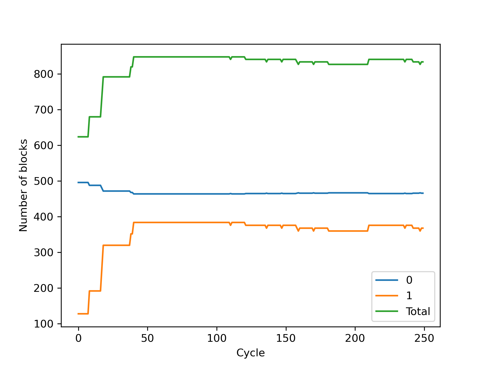
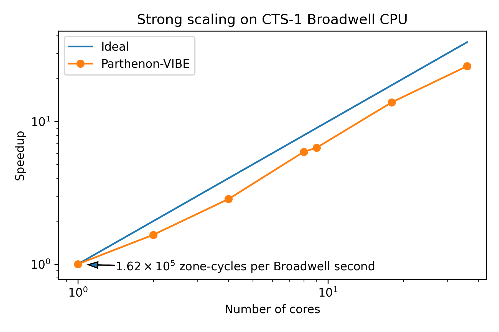

## Guide to Parthenon-VIBE: A benchmark that solves the Vector Inviscid Burgers' Equation on a block-AMR mesh

### Basic Description

This benchmark solves the inviscid Burgers' equation

$$
\begin{equation*}
\partial_t \mathbf{u} + \nabla\cdot\left(\frac{1}{2}\mathbf{u} \mathbf{u}\right) = 0
\end{equation*}
$$

and evolves one or more passive scalar quantities $q^i$ according to

$$
\begin{equation*}
\partial_t q^i + \nabla \cdot \left( q^i \mathbf{u} \right) = 0
\end{equation*}
$$

as well as computing an auxiliary quantity $d$ that resemebles a kinetic energy

$$
\begin{equation*}
d = \frac{1}{2} q^0 \mathbf{u}\cdot\mathbf{u}\;.
\end{equation*}
$$

Parthenon-VIBE makes use of a Godunov-type finite volume scheme with options for slope-limited linear or WENO5 reconstruction, HLL fluxes, and second order Runge-Kutta time integration.

### Parameters

The benchmark includes an input file _burgers.pin_ that specifies the base (coarsest level) mesh size, the size of a mesh block, the number of levels, and a variety of other parameters that control the behavior of Parthenon and the benchmark problem configuration.  The table below is an incomplete list of the available parameters, default values, and possible options.

| Block             | Paramter    | Default    | Options                        | Description | 
| -----                 | --------    | :------:   | :-----:                        | ----------- |
| <parthenon/mesh>      | refinement  | *adaptive* | {*adaptive*, *static*, *none*} | Is the mesh adaptively refined/derefined, statically refined, or uniform? *static* requires specifying refined regions separately, and is not recoommended for this benchmark.|
|                       | numlevel    | 2          | 1+                             | The total number of levels, including the base level |
|                       | deref_count | 10         | 1+                             | The number of time steps between possible derefinement operations. |
|                       | nghost      | 4          | {2,4}                          | The number of ghost cells on each side of a mesh block.  WENO5 reconstruction requires this to be set to 4, while linear can use 2. |
|                       | nx1         | 128        | >= nghost                      | The number of cells in the x-direction on the coarsest level |
|                       | nx2         | 128        | >= nghost                      | The number of cells in the y-direction on the coarsest level |
|                       | nx3         | 128        | >= nghost                      | The number of cells in the z-direction on the coarsest level |
| <parthenon/meshblock> | nx1         | 16         | must evenly divide mesh/nx1    | The number of cells in the x-direction in each mesh block |
|                       | nx2         | 16         | must evenly divide mesh/nx2    | The number of cells in the y-direction in each mesh block |
|                       | nx3         | 16         | must evenly divide mesh/nx3    | The number of cells in the z-direction in each mesh block |
| <parthenon/time>      | nlim        | 250         | any integer                    | The maximum number of time steps.  Negative values imply no bound. |
|                       | tlim        | 0.4        | any float                      | The total amount of simulation time to evolve the solution |
|                       | perf_cycle_offset | 0    | >= 0                           | Number of time steps at start up to skip before performance measurement begins |
| <parthenon/output0>   | dt          | -0.4        | any float                      | Simulated time between HDF5 dumps.  Setting this to a negative value disables HDF5 dumps, which is required if the benchmark was built without HDF5 support. |
| \<burgers>             | num_scalars | 8          | > 0                           | The number of scalar conservation laws to evolve, in addition to Burgers' equation. |
|                        | recon       | weno5      | {weno5, linear}               | Reconstruction method to define states on faces for Riemann solves.  weno5 uses a higher order function (5pt stencil, requires nghost = 4), while linear does a simple linear function (3pt stencil, requires only nghost = 2). |


### Building/running the benchmark

To build Parthenon on CPU, including this benchmark, with minimal external dependencies, start here:

```bash
parthenon$ mkdir build && cd build
parthenon$ cmake -DPARTHENON_DISABLE_HDF5=ON -DPARTHENON_DISABLE_OPENMP=ON -DPARTHENON_ENABLE_PYTHON_MODULE_CHECK=OFF ../
parthenon$ make -j
```
The executable `burgers-benchmark` should be built in `parthenon/build/benchmarks/burgers/` and can be run as, e.g.

```bash
mpirun -n 36 ./burgers-benchmark -i ../../../benchmarks/burgers/burgers.pin
```

To build for execution on a single GPU, it should be sufficient to add the following flags to the CMake configuration line

```cmake
-DPARTHENON_DISABLE_MPI=ON -DKokkos_ENABLE_CUDA=ON -DKokkos_ARCH_AMPERE80=ON
```
where `Kokkos_ARCH` should be set appropriately for the machine (see [here](https://kokkos.github.io/kokkos-core-wiki/keywords.html)).

### Memory Usage

The dominant memory usage in Parthenon-VIBE is for storage of the solution, for which two copies are required to support second order time stepping, for storing the update for a integrator stage (essentially the flux divergence), the intercell fluxes of each variable, for intermediate values of each solution variable on each side of every face, and for a derived quantity that we compute from the evolved solution.  From this we can construct a simple model for the memory usage $M$ as 

$$
\begin{align*}
\frac{M}{sizeof(Real)} =& 10 N_{blocks} (N_x^{block} + 2 N_{ghost}) (N_y^{block} + 2 N_{ghost}) (N_z^{block} + 2 N_{ghost}) N_{vars}\;\;\;\;\;\;\;\;\;\;\;\; \rm{Solution,\, intermediate\, intermediate\, face\, values,\, and\, derived}\\
                       +& N_{blocks} (N_x^{block} + 2*N_{ghost} + 1) (N_y^{block} + 2 N_{ghost}) (N_z^{block} + 2 N_{ghost}) N_{vars}\;\;\;\;\;\rm{x-Flux}\\
                       +& N_{blocks} (N_x^{block} + 2*N_{ghost}) (N_y^{block} + 2 N_{ghost} + 1) (N_z^{block} + 2 N_{ghost}) N_{vars}\;\;\;\;\;\rm{y-Flux}\\
                       +& N_{blocks} (N_x^{block} + 2*N_{ghost}) (N_y^{block} + 2 N_{ghost}) (N_z^{block} + 2 N_{ghost} + 1) N_{vars}\;\;\;\;\;\rm{z-Flux}\,.
\end{align*}
$$
For $16^3$ mesh blocks with 4 ghost cells, as configured by default in the provided input file, this corresponds to
$$
\begin{equation*}
\frac{M}{sizeof(Real)} = 181440 N_{blocks} N_{vars}
\end{equation*}
$$
or about 1.38 MB per block per variable for 8-byte Reals.  Actual memory usage will be larger than this in practice due to various other sources of memory usage, including Parthenon-provided buffers for communicating between blocks and internal buffers allocated by MPI, which scale with the number of blocks.

### Run Characteristics

As shipped, the benchmark is defined to have 512 mesh blocks on the base mesh ($128^3$ mesh decomposed into $16^3$ blocks), limiting MPI-parallelism to 512 ranks.  At the beginning of the calculation, there are a total of 624 mesh blocks distributed across two levels of refinement.  As the solution evolves, mesh blocks are dynamically created and destroyed, though the number of mesh blocks generally increases due to the nonlinear nature of Burgers' equation.  Figure 1 shows how the number of blocks on each level evolves as the run cycles through time steps.  By the end of the run, there are more than 800 mesh blocks.

<p style="text-align:center;"><br />
Figure 1: Number of mesh blocks as a function of time step cycle on the base mesh ("0"), the refineed level ("1"), and in total.</p>

On a two-socket Broadwell node with 36 cores, the benchmark takes approximately 213 seconds (3.5 minutes) to run to completion (250 time steps), averaging approximately $4.0\times 10^6$ zone-cycles/wallsecond.  On a single NVIDIA A100 GPU, the run completes in about 45 seconds, averaging approximately $1.8\times 10^7$ zone-cycles/wallsecond.  Strong scaling results on a single Broadwell node are shown below in Figure 2.

<p style="text-align:center;"<br />Figure 2: Strong scaling of the Parthenon-VIBE benchmark on a 36-core Broadwell node, run with one or more single-threaded MPI ranks.</p>

For the GPU, we measure throughput on a single-level mesh ("parthenon/mesh/numlevel = 1")


