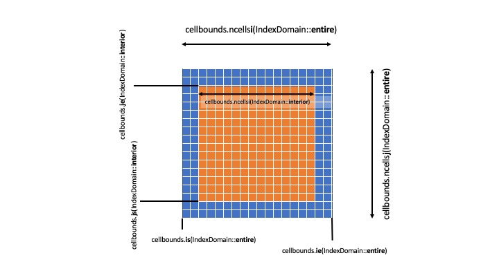

.. _domain:

Domain
======

IndexShape Class
----------------

The index shape class provides access to the index bounds of a mesh
block. The bounds are split into several domains which can be accessed
using a class enum ``IndexDomain``. The ``IndexDomain`` can be:

:``entire``: which allows one to access the starting indices of the full meshblock including ghost zones
:``interior``: which allows access to the interior of the meshblock excluding ghost cells
:``inner_x1``: which accesses the ghost zones for "inner" face of a meshblock in the ``x1`` direction
:``outer_x1``: which accesses the ghost zones for "outer" face of a meshblock in the ``x1`` direction
:``inner_x2``: which accesses the ghost zones for "inner" face of a meshblock in the ``x2`` direction
:``outer_x2``: which accesses the ghost zones for "outer" face of a meshblock in the ``x2`` direction
:``inner_x3``: which accesses the ghost zones for "inner" face of a meshblock in the ``x3`` direction
:``outer_x3``: which accesses the ghost zones for "outer" face of a meshblock in the ``x3`` direction

The starting and ending indices of each dimension of the index shape can
be accessed using the ``is``, ``ie``, ``js``, ``je``, ``ks``, ``ke``
methods. Currently, access is limited to three dimensions, if needed it
can be extended. In cases where the indices are called often it may be
more conveneint to pull out the index bounds of a given domain. The
``IndexRange`` struct provides an easy way to group the indices
together.

The ``IndexShape`` class also provides a means for accessing the number
of cells in each dimension of each of the domains. This is provided with
the ``ncellsi``, ``ncellsj``, and ``ncellsk`` methods.

Below is a diagram illustrating a 2d instance of an IndexShape which we
will call cellbounds.

IndexRange Struct
-----------------

The index range struct simply contains the starting and ending indices
as well as a method for returning the total number of cells within the
range.

Example Usage
-------------

The primary use case of the ``IndexShape`` occurs when indexing over the
different dimensions. Assuming we have a meshblock pointer given as
``pmb`` e.g.

.. code:: cpp

     const IndexRange ib = pmb->cellbounds.GetBoundsI(IndexDomain::interior); 
     const IndexRange jb = pmb->cellbounds.GetBoundsJ(IndexDomain::interior); 
     const IndexRange kb = pmb->cellbounds.GetBoundsK(IndexDomain::interior); 

     for( int k = kb.s; k <= kb.e; k++ ){
       for( int j = jb.s; j <= jb.e; j++ ){
         for( int i = ib.s; i <= ib.e; i++ ){
           ... code ..
         }
       }
     }
