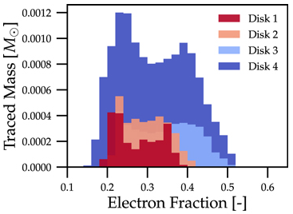
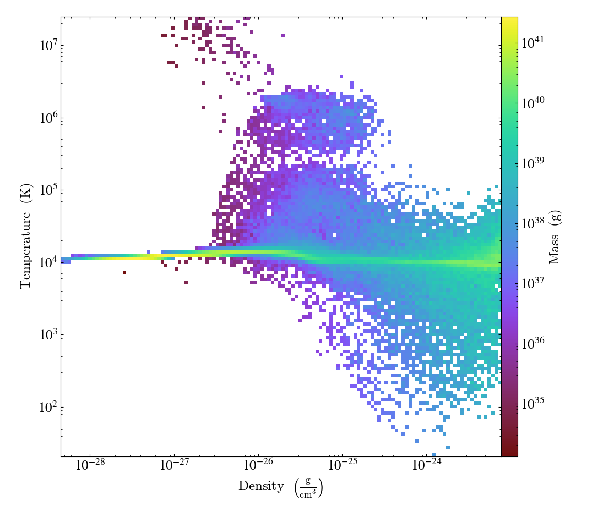

.. _outputs:

Outputs
=======

Outputs from Parthenon are controled via ``<parthenon/output*>`` blocks,
where ``*`` should be replaced by a unique integer for each block.

To disable an output block without removing it from the intput file set
the block's ``dt < 0.0``.

In addition to time base outputs, two additional options to trigger
outputs (applies to HDF5, restart and histogram outputs) exist.

-  Signaling: If ``Parthenon`` catches a signal, e.g., ``SIGALRM`` which
   is often sent by schedulers such as Slurm to signal a job of
   exceeding the job's allocated walltime, ``Parthenon`` will gracefully
   terminate and write output files with a ``final`` id rather than a
   number. This also applies to the ``Parthenon`` internal walltime
   limit, e.g., when executing an application with the ``-t HH:MM:SS``
   parameter on the command line.
-  File trigger: If a user places a file with the name ``output_now`` in
   the working directory of a running application, ``Parthenon`` will
   write output files with a ``now`` id rather than a number. After the
   output is being written the ``output_now`` file is removed and the
   simulation continues normally. The user can repeat the process any
   time by creating a new ``output_now`` file.

Note, in both cases the original numbering of the output will be
unaffected and the ``final`` and ``now`` files will be overwritten each
time without warning.

HDF5
----

Parthenon allows users to select which fields are captured in the HDF5
(``.phdf``) dumps at runtime. In the input file, include a
``<parthenon/output*>`` block, list of variables, and specify
``file_type = hdf5``. A ``dt`` parameter controls the frequency of
outputs for simulations involving evolution. If the optional parameter
``single_precision_output`` is set to ``true``, all variable data will
be written in single precision. A ``<parthenon/output*>`` block might
look like

::

   <parthenon/output1>
   file_type = hdf5
   # nonexistent variables/swarms are ignored
   variables = density, velocity, & # comments are still ok
               energy               # notice the & continuation character
                                    # for multiline lists
   swarms = tracers, photons  # Particle swarms
   swarm_variables = x, y, z  # swarm variables output for every swarm

   # Each swarm can sepcify in a separate list which additional
   # variables it would like to output.
   tracers_variables = x, y, z, rho, id
   photons_variables = x, y, z, frequency

   dt = 1.0
   file_number_width = 6 # default: 5
   use_final_label = true # default: true

   # Sparse variables may not be allocated on every block. By default
   # parthenon outputs de-allocated variables as 0 in the output
   # file. However, it is often convenient to output them as NaN
   # instead, marking deallocated and allocated but zero as
   # separate. This flag turns this functionality on.
   sparse_seed_nans = false # default false

This will produce an hdf5 (``.phdf``) output file every 1 units of
simulation time containing the density, velocity, and energy of each
cell. The files will be identified by a 6-digit ID, and the output file
generated upon completion of the simulation will be labeled
``*.final.*`` rather than with the integer ID.

HDF5 and restart files write variable field data with inline compression
by default. This is especially helpful when there are sparse variables
allocated only in a few blocks, because all other blocks would write
zeros of these variables, which can drastically increase output file
size (and decrease I/O performance) without compression. The optional
parameter ``hdf5_compression_level`` can be used to set the compression
level (between 1 and 9, default is 5). If ``parthenon`` is compiled with
support for compression, this also enables (logical) chunking of the
data in blocks of ``nx1*nx2*nx3``. Compression (and thus chunking) can
be disabled altogether with the CMake build option
``PARTHENON_DISABLE_HDF5_COMPRESSION``.
See the :ref:`building` for more details.

Tuning HDF5 Performance
-----------------------

Tuning IO parameters can be passed to Parthenon through the use of
environment variables. Available environment variables are:

+---------------------------+---------------+------------+------------------------------------------------------------------------------------------------------------------------------------------------------------------------------------------------------------------------------------------------------------------------------------------------------------------------------------------------------------------------------------------------------------------------------------------------------------+
| Environment Variable      | Initial State | Value Type | Description                                                                                                                                                                                                                                                                                                                                                                                                                                                |
+===========================+===============+============+============================================================================================================================================================================================================================================================================================================================================================================================================================================================+
|| H5_sieve_buf_size        || disabled     || int       || Sets the maximum size of the data sieve buffer, in bytes. The value should be equal to a multiple of the disk block size. If no value is set then the default is 256 KiB.                                                                                                                                                                                                                                                                                 |
|| H5_meta_block_size       || disabled     || int       || Sets the minimum metadata block size, in bytes. If no value is set then the default is 8 MiB. May help performance if enabled.                                                                                                                                                                                                                                                                                                                            |
|| H5_alignment_threshold   || disabled     || int       || The threshold value, in bytes, of H5Pset_alignment. Setting to 0 forces everything to be aligned. If a value is not set then the default is 0. Setting the environment variable automatically enables alignment.                                                                                                                                                                                                                                          |
|| H5_alignment_alignment   || disabled     || int       || The alignment value, in bytes, of H5Pset_alignment. If a value is not set then the default is 8 MiB. Setting the environment variable automatically enables alignment. H5Pset_alignment sets the alignment properties of a file access property list. Choose an alignment that is a multiple of the disk block size, enabling this usually shows better performance on parallel file systems. However, enabling may increase the file size significantly. |
|| H5_defer_metadata_flush  || disabled     || int       || Value of 1 enables deferring metadata flush. Value of 0 disables. Experiment with before using.                                                                                                                                                                                                                                                                                                                                                           |
|| MPI_access_style         || enabled      || string    || Specifies the manner in which the file will be accessed until the file is closed. Default is "write_once"                                                                                                                                                                                                                                                                                                                                                 |
|| MPI_collective_buffering || disabled     || int       || Value of 1 enables MPI collective buffering. Value of 0 disables. Experiment with before using.                                                                                                                                                                                                                                                                                                                                                           |
|| MPI_cb_block_size        || N/A          || int       || Sets the block size, in bytes, to be used for collective buffering file access. Default is 1 MiB.                                                                                                                                                                                                                                                                                                                                                         |
|| MPI_cb_buffer_size       || N/A          || int       || Sets the total buffer space, in bytes, that can be used for collective buffering on each target node, usually a multiple of cb_block_size. Default is 4 MiB.                                                                                                                                                                                                                                                                                              |
+---------------------------+---------------+------------+------------------------------------------------------------------------------------------------------------------------------------------------------------------------------------------------------------------------------------------------------------------------------------------------------------------------------------------------------------------------------------------------------------------------------------------------------------+

Restart Files
-------------

Parthenon allows users to output restart files for restarting a
simulation. The restart file captures the input file, so no input file
is required to be specified. Parameters for the input can be overriden
in the usual way from the command line. At a future date we will allow
for users the ability to extensively edit the parameters stored within
the restart file.

In the input file, include a ``<parthenon/output*>`` block and specify
``file_type = rst``. A ``dt`` parameter controls the frequency of
outputs for simulations involving evolution. A ``<parthenon/output*>``
block might look like

::

   <parthenon/output7>
   file_type = rst
   dt = 1.0

This will produce an hdf5 (``.rhdf``) output file every 1 units of
simulation time that can be used for restarting the simulation.

To use this restart file, simply specify the restart file with a
``-r <restart.rhdf>`` at the command line. If both ``-r <restart.rhdf>``
and ``-i <input.in>`` are specicifed, the simulation will be restarted from
the restart file with input parameter updated (or added) from the input file.

For physics developers: The fields to be output are automatically
selected as all the variables that have either the ``Independent`` or
``Restart`` ``Metadata`` flags specified. No other intervention is
required by the developer.

.. _output hist files:

History Files
-------------

In the input file, include a ``<parthenon/output*>`` block and specify
``file_type = hst``. A ``dt`` parameter controls the frequency of
outputs for simulations involving evolution. A ``<parthenon/output*>``
block might look like

::

   <parthenon/output8>
   file_type = hst
   dt = 1.0

This will produce a text file (``.hst``) output file every 1 units of
simulation time. The content of the file is determined by the functions
enrolled by a specific package, see :ref:`state history output`.

Histograms
----------

Parthenon supports calculating flexible 1D and 2D histograms in-situ that
are written to disk in HDF5 format.
Currently supported are

- 1D and 2D histograms (see examples below)
- binning by variable or coordinate (x1, x2, x3 and radial distance)
- counting samples and or summing a variable  
- weighting by volume and/or variable

The output format follows ``numpy`` convention, so that plotting data
with Python based machinery should be straightfoward (see example below).
In other words, 2D histograms use C-ordering corresponding to ``[x,y]``
indexing with ``y`` being the fast index.
In general, histograms are calculated using inclusive left bin edges and
data equal to the rightmost edge is also included in the last bin.

A ``<parthenon/output*>`` block containing one simple and one complex
example might look like::

   <parthenon/output8>
   file_type = histogram            # required, sets the output type
   dt = 1.0                         # required, sets the output interval
   hist_names = myname, other_name  # required, specifies the names of the histograms
                                    # in this block (used a prefix below and in the output)

   # 1D histogram ("standard", i.e., counting occurance in bin)
   myname_ndim = 1
   myname_x_variable = advected
   myname_x_variable_component = 0
   myname_x_edges_type = log
   myname_x_edges_num_bins = 10
   myname_x_edges_min = 1e-9
   myname_x_edges_max = 1e0
   myname_binned_variable = HIST_ONES

   # 2D histogram of volume weighted variable according to two coordinates
   other_name_ndim = 2
   other_name_x_variable = HIST_COORD_X1
   other_name_x_edges_type = list
   other_name_x_edges_list = -0.5, -0.25, 0.0, 0.25, 0.5
   other_name_y_variable = HIST_COORD_X2
   other_name_y_edges_type = list
   other_name_y_edges_list = -0.5, -0.1, 0.0, 0.1, 0.5
   other_name_binned_variable = advected
   other_name_binned_variable_component = 0
   other_name_weight_by_volume = true
   other_name_weight_variable = one_minus_advected_sq
   other_name_weight_variable_component = 0

with the following parameters

- ``hist_names=STRING, STRING, STRING, ...`` (comma separated names)
   The names of the histograms in this block.
   Will be used as preifx in the block as well as in the output file.
   All histograms will be written to the same output file with the "group" in the
   output corresponding to the histogram name.
- ``NAME_ndim=INT`` (either ``1`` or ``2``)
   Dimensionality of the histogram.
- ``NAME_x_variable=STRING`` (variable name or special coordinate string ``HIST_COORD_X1``, ``HIST_COORD_X2``, ``HIST_COORD_X3`` or ``HIST_COORD_R``)
   Variable to be used as bin. If a variable name is given a component has to be specified, too,
   see next parameter.
   For a scalar variable, the component needs to be specified as ``0`` anyway.
   If binning should be done by coordinate the special strings allow to bin by either one
   of the three dimensions or by radial distance from the origin.
- ``NAME_x_variable_component=INT``
   Component index of the binning variable.
   Used/required only if a non-coordinate variable is used for binning.
- ``NAME_x_edges_type=STRING`` (``lin``, ``log``, or ``list``)
   How the bin edges are defined in the first dimension.
   For ``lin`` and ``log`` direct indexing is used to determine the bin, which is significantly
   faster than specifying the edges via a ``list`` as the latter requires a binary search.
- ``NAME_x_edges_min=FLOAT``
   Minimum value (inclusive) of the bins in the first dim.
   Used/required only for ``lin`` and ``log`` edge type.
- ``NAME_x_edges_max=FLOAT``
   Maximum value (inclusive) of the bins in the first dim.
   Used/required only for ``lin`` and ``log`` edge type.
- ``NAME_x_edges_num_bins=INT`` (must be ``>=1``)
   Number of equally spaced bins between min and max value in the first dim.
   Used/required only for ``lin`` and ``log`` edge type.
- ``NAME_x_edges_list=FLOAT,FLOAT,FLOAT,...`` (comma separated list of increasing values)
   Arbitrary definition of edge values with inclusive innermost and outermost edges.
   Used/required only for ``list`` edge type.
- ``NAME_y_edges...``
   Same as the ``NAME_x_edges...`` parameters except for being used in the second
   dimension for ``ndim=2`` histograms.
- ``NAME_accumulate=BOOL`` (``true`` or ``false`` default)
   Accumulate data that is outside the binning range in the outermost bins.
- ``NAME_binned_variable=STRING`` (variable name or ``HIST_ONES``)
   Variable to be binned. If a variable name is given a component has to be specified, too,
   see next parameter.
   For a scalar variable, the component needs to be specified as ``0`` anyway.
   If sampling (i.e., counting the number of value inside a bin) is to be used the special
   string ``HIST_ONES`` can be set.
- ``NAME_binned_variable_component=INT``
   Component index of the variable to be binned.
   Used/required only if a variable is binned and not ``HIST_ONES``.
- ``NAME_weight_by_volume=BOOL`` (``true`` or ``false``)
   Apply volume weighting to the binned variable. Can be used simultaneously with binning
   by a different variable. Note that this does *not* include any normalization
   (e.g., by total volume or the sum of the weight variable in question) and is left to
   the user during post processing.
- ``NAME_weight_variable=STRING``
   Variable to be used as weight.
   Can be used together with volume weighting.
   For a scalar variable, the component needs to be specified as ``0`` anyway.
- ``NAME_weight_variable_component=INT``
   Component index of the variable to be used as weight.

Note, weighting by volume and variable simultaneously might seem counterintuitive, but
easily allows for, e.g., mass-weighted profiles, by enabling weighting by volume and
using a mass density field as additional weight variable.

In practice, a 1D histogram in the astrophysical context may look like (top panel from
Fig 4 in `Curtis et al 2023 ApJL 945 L13 <https://dx.doi.org/10.3847/2041-8213/acba16>`_):

Translating this to the notation used for Parthenon histogram outputs means specifying
for each histogram

- the field containing the Electron fraction as ``x_variable``\ ,
- the field containing the traced mass density as ``binned_variable``\ , and
- enable ``weight_by_volume`` (to get the total traced mass).

Similarly, a 2D histogram (also referred to as phase plot) example may look like
(from the `yt Project documentation <https://yt-project.org/doc/visualizing/plots.html#d-phase-plots>`_):

Translating this to the notation used for Parthenon histogram outputs means using

- the field containing the density as ``x_variable``\ ,
- the field containing the temperature as ``y_variable``\ ,
- the field containing the mass density as ``binned_variable``\ , and
- enable ``weight_by_volume`` (to get the total mass).

The following is a minimal example to plot a 1D and 2D histogram from the output file:

.. code:: python

   with h5py.File("parthenon.out8.histograms.00040.hdf", "r") as infile:
     # 1D histogram
      x = infile["myname/x_edges"][:]
      y = infile["myname/data"][:]
      plt.plot(x, y)
      plt.show()

      # 2D histogram
      x = infile["other_name/x_edges"][:]
      y = infile["other_name/y_edges"][:]
      z = infile["other_name/data"][:].T   # note the transpose here (so that the data matches the axis for the pcolormesh)
      plt.pcolormesh(x,y,z,)
      plt.show()   

Ascent (optional)
-----------------

Parthenon supports in situ visualization and analysis via the external
`Ascent <https://ascent.readthedocs.io>`__ library.
Support for Ascent is disabled by default and must be enabled via ``PARTHENON_ENABLE_ASCENT=ON`` during configure.

In the input file, include a ``<parthenon/output*>`` block and specify ``file_type = ascent``.
A ``dt`` parameter controls the frequency of outputs for simulations involving evolution.
*Note* that in principle Ascent can control its own output cadence (including
automated tiggers).
If you want to call Ascent on every cycle, set ``dt`` to a value smaller than the actual simulation ``dt``.
The mandatory ``actions_file`` parameter points to a separate file that defines
Ascent actions in ``.yaml`` or ``.json`` format, see
`Ascent documentation <https://ascent.readthedocs.io/en/latest/Actions/index.html>`__ for a complete list of options.

Parthenon currently only publishes cell-centered variables to Ascent.
Moreover, the published name of the field always starts with the base name (to avoid
name clashes between multiple fields that may have the same [component] labels).
If component label(s) are provided, they will be added as a suffix, e.g,.
``basename_component-label`` for all variable types (even scalars).
Otherwise, an integer index is added for vectors/tensors with more than one component, i.e.,
vectors/tensors with a single component and without component labels will not contain a suffix.
The definition of component labels for variables is typically done by downstream codes
so that the downstream documention should be consulted for more specific information.

A ``<parthenon/output*>`` block might look like::

  <parthenon/output9>
  file_type = ascent
  dt = 1.0
  actions_file = my_actions.yaml

see also the advection example
`input file <https://github.com/parthenon-hpc-lab/parthenon/blob/develop/example/advection/parthinput.advection>`__ and
`actions file <https://github.com/parthenon-hpc-lab/parthenon/blob/develop/example/advection/custom_ascent_actions.yaml>`__.

*Note* by default "field filtering" is enabled for Ascent in Parthenon, i.e.,
only fields that are used in Ascent actions are published.
There may be cases, where Ascent cannot determine which fields it needs for
an action and will fail.
In this case, add an ``ascent_options.yaml`` file to the run directory containing::

  field_filtering: false

to override at runtime.
See `Ascent documenation <https://ascent.readthedocs.io/en/latest/AscentAPI.html#field-filtering>`__ for more information.

Python scripts
--------------

The ``scripts/python`` folder includes scripts that may be useful for
visualizing or analyzing data in the ``.phdf`` files. The ``phdf.py``
file defines a class to read in and query data. The ``movie2d.py``
script shows an example of using this class, and also provides a
convenient means of making movies of 2D simulations. The script can be
invoked as

::

   python3 /path/to/movie2d.py name_of_variable *.phdf

which will produce a ``png`` image per dump suitable for encoding into a
movie.

Visualization software
----------------------

Both `ParaView <https://www.paraview.org/>`__ and
`VisIt <https://wci.llnl.gov/simulation/computer-codes/visit/>`__ are
capable of opening and visualizing Parthenon graphics dumps. In both
cases, the ``.xdmf`` files should be opened. In ParaView, select the
“XDMF Reader” when prompted.

Preparing outputs for ``yt``
----------------------------

Parthenon HDF5 outputs can be read with the python visualization library
`yt <https://yt-project.org/>`__ as certain variables are named when
adding fields via ``StateDescriptor::AddField`` and
``StateDescriptor::AddSparsePool``. Variable names are added as a
``std::vector<std::string>`` in the variable metadata. These labels are
optional and are only used for output to HDF5. 4D variables are named
with a list of names for each row while 3D variables are named with a
single name. For example, the following configurations are acceptable:

.. code:: cpp

   auto pkg = std::make_shared<StateDescriptor>("Hydro");

   /* ... */
   const int nhydro = 5;
   std::vector<std::string> cons_labels(nhydro);
   cons_labels[0]="Density";
   cons_labels[1]="MomentumDensity1";
   cons_labels[2]="MomentumDensity2";
   cons_labels[3]="MomentumDensity3";
   cons_labels[4]="TotalEnergyDensity";
   Metadata m({Metadata::Cell, Metadata::Independent, Metadata::FillGhost},
              std::vector<int>({nhydro}), cons_labels);
   pkg->AddField("cons", m);

   const int ndensity = 1;
   std::vector<std::string> density_labels(ndensity);
   density_labels[0]="Density";
   m = Metadata({Metadata::Cell, Metadata::Derived}, std::vector<int>({ndensity}), density_labels);
   pkg->AddField("dens", m);

   const int nvelocity = 3;
   std::vector<std::string> velocity_labels(nvelocity);
   velocity_labels[0]="Velocity1";
   velocity_labels[1]="Velocity2";
   velocity_labels[2]="Velocity3";
   m = Metadata({Metadata::Cell, Metadata::Derived}, std::vector<int>({nvelocity}), velocity_labels);
   pkg->AddField("vel", m);

   const int npressure = 1;
   std::vector<std::string> pressure_labels(npressure);
   pressure_labels[0]="Pressure";
   m = Metadata({Metadata::Cell, Metadata::Derived}, std::vector<int>({npressure}), pressure_labels);
   pkg->AddField("pres", m);

The ``yt`` frontend needs either the hydrodynamic conserved variables or
primitive compute derived quantities. The conserved variables must have
the names ``"Density"``, ``"MomentumDensity1"``, ``"MomentumDensity2"``,
``"MomentumDensity3"``, ``"TotalEnergyDensity"`` while the primitive
variables must have the names ``"Density"``, ``"Velocity1"``,
``"Velocity2"``, ``"Velocity3"``, ``"Pressure"``. Either of these sets
of variables must be named and present in the output, with the primitive
variables taking precedence over the conserved variables when computing
derived quantities such as specific thermal energy. In the above
example, including either ``"cons"`` or ``"dens"``, ``"vel"``, and
``"pres"`` in the HDF5 output would allow ``yt`` to read the data.

Additional parameters can also be packaged into the HDF5 file to help
``yt`` interpret the data, namely adiabatic index and code unit
information. These are identified by passing ``true`` as an optional
boolean argument when adding parameters via
``StateDescriptor::AddParam``. For example,

.. code:: cpp

   pkg->AddParam<double>("CodeLength", 100,true);
   pkg->AddParam<double>("CodeMass", 1000,true);
   pkg->AddParam<double>("CodeTime", 1,true);
   pkg->AddParam<double>("AdibaticIndex", 5./3.,true);

   pkg->AddParam<int>("IntParam", 0,true);
   pkg->AddParam<std::string>("EquationOfState", "Adiabatic",true);

adds the parameters ``CodeLength``, ``CodeMass``, ``CodeTime``,
``AdiabaticIndex``, ``IntParam``, and ``EquationOfState`` to the HDF5
output. Currently, only ``int``, ``float``, and ``std::string``
parameters can be included with the HDF5.

Code units can be defined for ``yt`` by including the parameters
``CodeLength``, ``CodeMass``, and ``CodeTime``, which specify the code
units used by Parthenon in terms of centimeters, grams, and seconds by
writing the parameters. In the above example, these parameters dictate
``yt`` to interpret code lengths in the data in units of 100 centimeters
(or 1 meter per code unit), code masses in units of 1000 grams (or 1
kilogram per code units) and code times in units of seconds (or 1 second
per code time). Alternatively, this unit information can also be
supplied to the ``yt`` frontend when loading the data. If code units are
not defined in the HDF5 file or at load time, ``yt`` will assume that
the data is in ``CGS``.

The adiabatic index can also be specified via the parameter
``AdiabaticIndex``, defined at load time for ``yt``, or left as its
default ``5./3.``.

For example, the following methods are valid to load data with ``yt``

.. code:: python

   filename = "parthenon.out0.00000.phdf"

   #Read units and adiabatic index from the HDF5 file or use defaults
   ds = yt.load(filename)

   #Specify units and adiabatic index explicitly
   units_override = {"length_unit" : (100, "cm"),
                     "time_unit"   : (1,   "s"),
                     "mass_unit"   : (1000,"g")}

   ds = yt.load(filename,units_override=units_override,gamma=5./3.)

Currently, the ``yt`` frontend for Parthenon is hosted on the
``parthenon-frontend`` branch of this `yt fork <https://github.com/forrestglines/yt/tree/parthenon-frontend>`_. In
the future, the Parthenon frontend will be included in the main ``yt``
repo.
