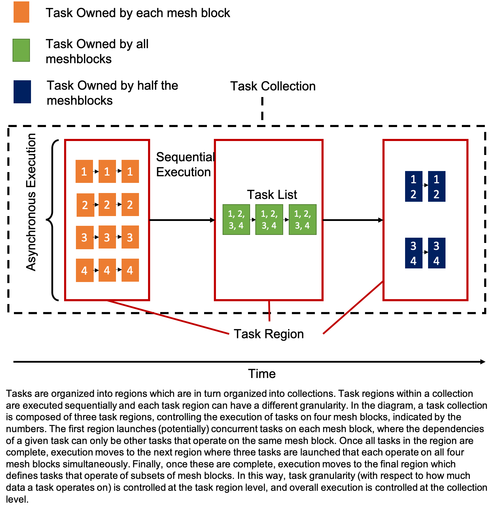

.. _tasks:

Tasks
=====

Parthenon's tasking infrastructure is how downstream applications describe 
and execute their work.  Tasks are organized into a hierarchy of objects.
``TaskCollection``s have one or more ``TaskRegion``s, ``TaskRegion``s have
one or more ``TaskList``s, and ``TaskList``s can have one or more sublists
(that are themselves ``TaskList``s).

Task
----

Though downstream codes never have to interact with the ``Task`` object directly,
it's useful to describe nonetheless.  A ``Task`` object is essentially a functor
that stores the necessary data to invoke a downstream code's functions with
the desired arguments.  Importantly, however, it also stores information that
relates itself to other tasks, namely the tasks that must be complete before
it should execute and the tasks that may be available to run after it completes.
In other words, ``Task``s are nodes in a directed (possibly cyclic) graph, and
include the edges that connect to it and emerge from it.

TaskList
--------

The ``TaskList`` class stores a vector of all the tasks and sublists (a nested
``TaskList``) added to it.  Additionally, it stores various bookkeeping
information that facilitate more advanced features described below.  Adding
tasks and sublists are the only way to interact with ``TaskList`` objects.

The basic call to ``AddTask`` takes the task's dependencies, the function to be
executed, and the arguments to the function as its arguments.  ``AddTask`` returns
a ``TaskID`` object that can be used in subsequent calls to ``AddTask`` as a
dependency either on its own or combined with other ``TaskID``s via the ``|``
operator.  Use of the ``|`` operator is historical and perhaps a bit misleading as
it really acts as a logical and -- that is, all tasks combined with ``|`` must be
complete before the dependencies are satisfied.  An overload of ``AddTask`` takes
a ``TaskQualifier`` object as the first argument which specifies certain special,
non-default behaviors.  These will be described below.  Note that the default
constructor of ``TaskID`` produces a special object that when passed into
``AddTask`` signifies that the task has no dependencies.

The ``AddSublist`` function adds a nested ``TaskList`` to the ``TaskList`` on
which its called.  The principle use case for this is to add iterative cycles
to the graph, allowing one to execute a series of tasks repeatedly until some
criteria are satisfied.  The call takes as arguments the dependencies (via
``TaskID``s combined with ``|``) that must be complete before the sublist
exectues and a ``std::pair<int, int>`` specifying the minimum
and maximum number of times the sublist should execute.  Passing something like
``{min_iters, max_iters}`` as the second argument should suffice, with `{1, 1}`
leading to a sublist that never cycles.  ``AddSublist``
returns a ``std::pair<TaskList&, TaskID>`` which is conveniently accessed via
a structured binding, e.g.
.. code:: cpp
  TaskID none;
  auto [child_list, child_list_id] = parent_list.AddSublist(dependencies, {1,3});
  auto task_id = child_list.AddTask(none, SomeFunction, arg1, arg2);
In the above example, passing ``none`` as the dependency for the task added to
``child_list`` does not imply that this task can execute at any time since
``child_list`` itself has dependencies that must be satisfied before any of its
tasks can be invoked.

TaskRegion
----------

Under the hood, a ``TaskRegion`` is a directed, possibly cyclic graph.  The graph
is built up incrementally as tasks are added to the ``TaskList``s within the 
``TaskRegion``, and it's construction is completed upon the first time it's
executed.  ``TaskRegion``s can have one or more ``TaskList``s.  The primary reason
for this is to allow flexibility in how work is broken up into tasks (and
eventually kernels).  A region with many lists will produce many small
tasks/kernels, but may expose more asynchrony (e.g. MPI communication).  A region
with fewer lists will produce more work per kernel (which may be good for GPUs,
for example), but may limit asynchrony.  Typically, each list is tied to a unique
partition of the mesh blocks owned by a rank.  ``TaskRegion`` only provides a few
public facing functions:
- ``TaskListStatus Execute(ThreadPool &pool)``: ``TaskRegion``s can be executed, requiring a
``ThreadPool`` be provided by the caller.  In practice, ``Execute`` is usually
called from the ``Execute`` member function of ``TaskCollection``.
- ``TaskList& operator``: return a reference to the ``i``th
``TaskList`` in the region.
- ``size_t size()``: return the number of ``TaskList``s in the region.

TaskCollection
--------------

A ``TaskCollection`` contains a
``std::vector<TaskRegion>``, i.e. an ordered list of ``TaskRegion``\ s.
Importantly, each ``TaskRegion`` will be executed to completion before
subsequent ``TaskRegion``\ s, introducing a notion of sequential
execution and enabling flexibility in task granularity. For example, the
following code fragment uses the ``TaskCollection`` and ``TaskRegion``
abstractions to express work that can be done asynchronously across
blocks, followed by a bulk synchronous task involving all blocks, and
finally another round of asynchronous work.

.. code:: cpp

  TaskCollection tc;
  TaskRegion &tr1 = tc.AddRegion(nmb);
  for (int i = 0; i < nmb; i++) {
    auto task_id = tr1[i].AddTask(dep, foo, args, blocks[i]);
  }

  {
    TaskRegion &tr2 = tc.AddRegion(1);
    auto sync_task = tr2[0].AddTask(dep, bar, args, blocks);
  }

  TaskRegion &tr3 = tc.AddRegion(nmb);
  for (int i = 0; i < nmb; i++) {
    auto task_id = tr3[i].AddTask(dep, foo, args, blocks[i]);
  }

A diagram illustrating the relationship between these different classes
is shown below.

``TaskCollection`` provides a few 
public-facing functions:
- ``TaskRegion& AddRegion(const int num_lists)``: Add and return a reference to
a new ``TaskRegion`` with the specified number of ``TaskList``s.
- ``TaskListStatus Execute(ThreadPool &pool)``: Execute all regions in the
collection.  Regions are executed completely, in the order they were added,
before moving on to the next region.  Task execution will take advantage of
the provided ``ThreadPool`` to (possibly) execute tasks across ``TaskList``s
in each region concurrently.
- ``TaskListStatus Execute()``: Same as above, but execution will use an
internally generated ``ThreadPool`` with a single thread.

NOTE: Work remains to make the rest of
Parthenon thread-safe, so it is currently required to use a ``ThreadPool``
with one thread.

TaskQualifier
-------------

``TaskQualifier``s provide a mechanism for downstream codes to alter the default
behavior of specific tasks in certain ways.  The qualifiers are described below:
- ``TaskQualifier::local_sync``: Tasks marked with ``local_sync`` synchronize across
lists in a region on a given MPI rank.  Tasks that depend on a ``local_sync``
marked task gain dependencies from the corresponding task on all lists within
a region.  A typical use for this qualifier is to do a rank-local reduction, for
example before initiating a global MPI reduction (which should be done only once
per rank, not once per ``TaskList``).  Note that Parthenon links tasks across
lists in the order they are added to each list, i.e. the ``n``th ``local_sync`` task
in a list is assumed to be associated with the ``n``th ``local_sync`` task in all
lists in the region.
- ``TaskQualifier::global_sync``: Tasks marked with ``global_sync`` implicitly have
the same semantics as ``local_sync``, but additionally do a global reduction on the
``TaskStatus`` to determine if/when execution can proceed on to dependent tasks.
- ``TaskQualifier::completion``: Tasks marked with ``completion`` can lead to exiting
execution of the owning ``TaskList``.  If these tasks return ``TaskStatus::complete``
and the minimum number of iterations of the list have been completed, the remainder
of the task list will be skipped (or the iteration stopped).  Returning
``TaskList::iterate`` leads to continued execution/iteration, unless the maximum
number of iterations has been reached.
- ``TaskQualifier::once_per_region``: Tasks with the ``once_per_region`` qualifier
will only execute once (per iteration, if relevant) regardless of the number of
``TaskList``s in the region.  This can be useful when, for example, doing MPI
reductions, printing out some rank-wide state, or calling a ``completion`` task
that depends on some global condition where all lists would evaluate identical code.

``TaskQualifier``s can be combined via the ``|`` operator and all combinations are
supported.  For example, you might mark a task ``global_sync | completion | once_per_region``
if it were a task to determine whether an iteration should continue that depended
on some previously reduced quantity.
