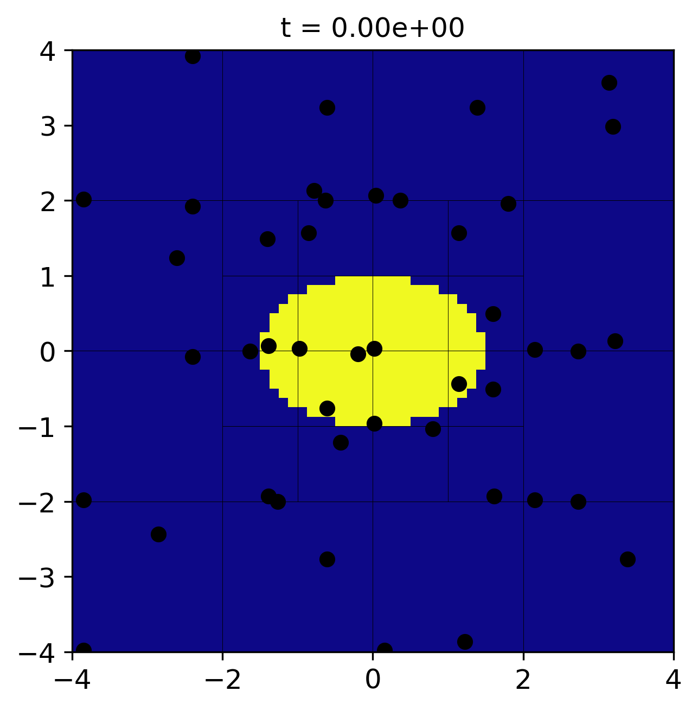
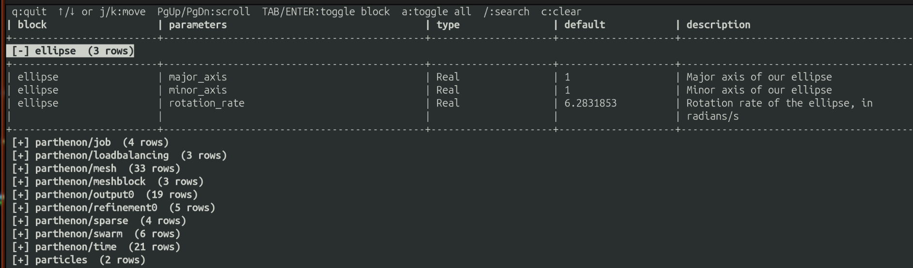

.. _tutorial:

Writing your first Parthenon-based Code
=========================================

In this tutorial, we will walk through how to write a Parthenon-based
code from scratch. We'll build a simple toy code that rotates an
ellipse in a circle, with AMR, to demonstrate the elements that make
up a Parthenon code and high-level Parthenon concepts.

A full working version of the code described here is available on the
`Parthenon-HPC-Lab github`_.

.. _Parthenon-HPC-Lab github: https://github.com/parthenon-hpc-lab/ellipse-example

Prerequisites
---------------

Parthenon requires, at a minimum, a C++20 compiler, Git, and CMake. Most
real applications also require an MPI library (MPI stands for message
passing interface) for parallelism. In this tutorial, we'll also be
relying on HDF5 for output and numpy, matplotlib, and h5py for
visualization. On Ubuntu Linux, you can install the non-Python
dependencies as

.. code-block:: bash

   sudo apt install build-essential libmpich-dev libhdf5-mpich-dev hdf5-tools git cmake

On Mac OS, via homebrew, it is sufficient to run

.. code-block:: bash

   brew install hdf5-mpi 
   brew install cmake

.. note::

   The tutorial will build/run without MPI, but HDF5 is essential.

For Python, use your preferred Python environment. I suggest a
project-specific Python virtual environment:

.. code-block:: bash

   python -m venv .venv
   source .venv/bin/activate
   python -m pip install --upgrade pip
   python -m pip install numpy matplotlib h5py

.. note::

   Python and CMake can interfere with each other. I find this is
   especially true with Anaconda and friends, as Anaconda can install,
   e.g., a serial version of HDF5, which CMake finds when it
   configures. Thus, I recommend activating your virtual environment
   but leaving your conda environment inactive.

Directory structure
---------------------

The most common way to include Parthenon in a project is to build it
*in-tree*. This means creating a repository for your code and
including Parthenon *inside* it. This typically looks like:

.. code-block::

   ellipse/
   ├── CMakeLists.txt
   ├── external
   │   └── parthenon
   └── src

where here I've assumed we named our code *ellipse*. The source code
for the new ellipse executable will live in ``src``, and Parthenon
will live in ``external/parthenon``. Note the ``CMakeLists.txt`` file;
we'll come back to that.

The most common way to include Parthenon in a project under Git
version control is Git submodules, which allow a Git repository to
be included inside another Git repository such that the source code
for the dependency isn't directly committed into the downstream
project. Let's set it up. You can get to the project structure with:

.. code-block:: bash

   mkdir ellipse
   cd ellipse
   git init
   mkdir external
   mkdir src
   touch CMakeLists.txt
   git submodule add git@github.com:parthenon-hpc-lab/parthenon.git external/parthenon
   git add external parthenon
   git commit -m "add parthenon"

Parthenon itself also has submodules. We need to clone them for a
Parthenon-based project to build. Do so via

.. code-block:: bash

   git submodule update --init --recursive

You can now commit files and push as you normally would. If you want
to update Parthenon, simply go inside the Parthenon directory inside
your project, check out the relevant release or branch and pull. Then
you can commit the folder as if you were working with raw source code
and Git will do the right thing.

.. note::

   Parthenon also has a Spack package (``spackage``). You can see
   details in our :ref:`build doc <building>`.

The top-level ``CMakeLists.txt``
^^^^^^^^^^^^^^^^^^^^^^^^^^^^^^^^^^

``CMake`` is a configuration language. It tells your computer how to find
and tie together dependencies and builds a ``makefile`` which actually
calls the compiler to build your code. The top-level
``CMakeLists.txt`` file contains some of these details. Open the file
and edit it to look like this:

.. code-block:: cmake

   # This is required by the CMake standard
   cmake_minimum_required(VERSION 3.26)
   
   # Names the project ellipse
   project(ellipse LANGUAGES C CXX)
   # We require C++20
   set(CMAKE_CXX_STANDARD 20)
   # A useful command for debugging
   set(CMAKE_EXPORT_COMPILE_COMMANDS On)

   # This is just a safety thing, but I recommend including it. It
   # forces you to build the code in a directory that isn't the same as
   # your source code.
   file(TO_CMAKE_PATH "${PROJECT_BINARY_DIR}/CMakeLists.txt" LOC_PATH)
   if(EXISTS "${LOC_PATH}")
     message(FATAL_ERROR
      "You cannot build in a source directory (or any directory with a CMakeLists.txt file). "
      "Please make a build subdirectory. Feel free to remove CMakeCache.txt and CMakeFiles.")
   endif()

   # Mostly a convenience thing. If you don't specify which flags to
   # compile with, CMake prefers a recipe "RelWithDebInfo" which is a
   # mix of code speed and debugging. For maximum performance, specify
   # -DCMAKE_BUILD_TYPE=Release. For debugging, specify
   # -DCMAKE_BUILD_TYPE=Debug.
   set(default_build_type "RelWithDebInfo")
   if(NOT CMAKE_BUILD_TYPE AND NOT CMAKE_CONFIGURATION_TYPES)
     message(STATUS "Setting build type to '${default_build_type}' as none was specified.")
     set(CMAKE_BUILD_TYPE "${default_build_type}" CACHE
       STRING "Choose the type of build." FORCE)
     # Set the possible values of build type for cmake-gui
     set_property(CACHE CMAKE_BUILD_TYPE PROPERTY STRINGS
       "Debug" "Release" "MinSizeRel" "RelWithDebInfo")
   endif()

   # Parthenon can also be built standalone. But since we're building
   # it as part of our ellipse project, let's disable the tests and
   # example code that come with it.
   set(PARTHENON_DISABLE_EXAMPLES ON CACHE BOOL "" FORCE)
   set(BUILD_TESTING OFF CACHE BOOL "" FORCE)
   # add Parthenon
   add_subdirectory(external/parthenon parthenon)

   # This command will error out currently, but we want it to tell
   # CMake to look for our source code once we write some
   add_subdirectory(src)

A fully-featured project may have many more things in the top-level
CMake, such as code for unit tests and additional dependency
handling. But we'll stick with this for now.

Now let's start writing some code and discussing some high-level
Parthenon concepts.

High-level Parthenon concepts
-------------------------------

A Parthenon-based project consists of:

* Any number of *packages*, which, conceptually, own work to do and state on which to operate.

* At least one *problem generator* which provides initial conditions for the solver.

* A *driver* which orchestrates work.

* A main function which calls a ``ParthenonManager`` to provide setup/teardown and entry into a program.

Let's go through each of them.

Packages
----------

In practice, a Parthenon *package* is a C++ ``namespace`` that
contains any programs/functions you may want to include. In particular
you *must* include an ``Initialize`` function, and you *probably* want
to include at least one *task*. We'll talk about tasks in a
minute. For now, let's create an ``Initialize`` function. We'll follow
standard C++ style and create a header file, ``ellipse.hpp`` in a new
folder in ``src`` we'll call ``ellipse``:

.. code-block:: bash

   mkdir src/ellipse
   
and in the new ``ellipse`` folder:

.. code-block:: cpp

   #ifndef _ELLIPSE_ELLIPSE_HPP_
   #define _ELLIPSE_ELLIPSE_HPP_
   
   #include <memory>

   #include <parthenon/package.hpp>
   #include <utils/robust.hpp>
   
   namespace Ellipse {
   using namespace parthenon::package::prelude;
   
   // Returns true if x and y are inside an ellipse with major axis a
   // and minor axis b that has been rotated by th radians.
   KOKKOS_INLINE_FUNCTION
   bool InsideEllipse(const Real x, const Real y, const Real a, const Real b, const Real th) {
     constexpr Real EPS = parthenon::robust::EPS();
     const Real c = Kokkos::cos(th);
     const Real s = Kokkos::sin(th);
   
     const Real xp =  c * x + s * y;
     const Real yp = -s * x + c * y;
   
     const Real aa = a * a;
     const Real bb = b * b;
   
     return (xp * xp) / (aa + EPS) + (yp * yp) / (bb + EPS) <= 1.0;
   }

   // This is going to be the name of a variable we're going to set
   PAR_VAR(Ellipse, Indicator);

   // Our initialize function
   std::shared_ptr<StateDescriptor> Initialize(ParameterInput *pin);
   // Our function that will rotate the ellipse
   TaskStatus Rotate(MeshData<Real> *md, const Real new_time);
   
   } // namespace Ellipse
   
   #endif // _ELLIPSE_ELLIPSE_HPP_

We'll discuss the ``InsideEllipse`` utility function and ``Rotate``
task later. For now let's discuss the ``Initialize`` function and the
``PAR_VAR`` macro. The macro creates a C++ type that represents the
name of a variable that we're naming ``Ellipse.Indicator``, which
will be 1 when we're inside the ellipse and 0 otherwise. The
type-based variable machinery is useful as it allows us to access
variables by a string-like name on GPUs, which otherwise wouldn't
work, as strings don't function easily on GPUs. It also means typos in
names are caught at compile time, rather than run time.

The ``Initialize`` function returns a ``std::shared_ptr`` (a pointer
with built-in memory management) to a ``StateDescriptor`` object. A
``StateDescriptor`` object tells the Parthenon infrastructure what a
package expects the infrastructure to provide so it can do its
job. This may be variables on the mesh, but it might also be global
variables owned/managed by a package, which we call ``Params``. The
``Initialize`` function can also parse the input file through the
``ParameterInput`` pointer. Let's put our Initialize function in
``ellipse/ellipse.cpp``. It'll look like this:

.. code-block:: cpp

   #include <cmath>
   #include "ellipse.hpp"

   #include <parthenon/package.hpp>
   using namespace parthenon::package::prelude;

   std::shared_ptr<StateDescriptor> Ellipse::Initialize(ParameterInput *pin) {
     // Creates the state descriptor object
     auto pkg = std::make_shared<StateDescriptor>("ellipse");
   
     // parse input deck and add params for ellipse shape.
     const Real major_axis = pin->GetOrAddReal("ellipse", "major_axis", 1.0,
                                               "Major axis of our ellipse");
     const Real minor_axis = pin->GetOrAddReal("ellipse", "minor_axis", 1.0,
                                               "Minor axis of our ellipse");
     pkg->AddParam("major_axis", major_axis);
     pkg->AddParam("minor_axis", minor_axis);
   
     const Real omega = pin->GetOrAddReal("ellipse", "rotation_rate", 2 * M_PI,
                                          "Rotation rate of the ellipse, in radians/s");
     pkg->AddParam("omega", omega);

     // register the indicator variable
     Metadata m({Metadata::OneCopy, Metadata::Cell});
     pkg->AddField<Indicator>(m);
   
     return pkg;
   }

Let's walk through what's happening. The first line creates the
``StateDescriptor`` object and wraps it in a shared pointer, which we
will return at the end of the function. The next few lines call
``pin->GetOrAddReal``. This is Parthenon's input parsing. We are
requesting variables in the "Ellipse" section of the input deck (we'll
look at an input deck later) named "major_axis" and "minor_axis". The
first argument is the input block, the second the variable name, and
the third the default value. The fourth is a Python-like docstring
that Parthenon can report.

We register the major and minor axes in the package's ``Params``
registry with ``pkg->AddParam``, which stashes them away as constants
we can access from a package. ``Params`` are a Python-like
type-erasing dictionary. We'll see how to pull data out of them
later. They're useful as a global store for simulation parameters that
need to be accessed in different places throughout the code. We do the
same with the rotation rate ``omega``.

We then add the ``Indicator`` field with
``pkg->AddField<Indicator>(m);``. This command *does not* allocate
memory or create the field on the mesh right now. It just declares to
Parthenon that the field should be available. Parthenon will handle the
rest, but ``Initialize`` is called before the mesh is created. The
type-based variable is passed inside the angle brackets as a
*template argument*, but a string might also be used, e.g.,
``pkg->AddField("Ellipse.Indicator", m);``. The ``Metadata`` object
passed in describes to the infrastructure the properties we want the
variable to have. In this case, we want it to be cell-centered and
``OneCopy``. The latter means that if Parthenon were to create multiple
copies of state, e.g., multiple time levels in a Runge-Kutta
integration, it treats this field as a shallow copy, and doesn't deep
copy it. See :ref:`state management <state>` for more details.

Anatomy of a Task
^^^^^^^^^^^^^^^^^^^

Now let's take a look at the rotate task. A task is work that you will
ask Parthenon to do. You can think of it as a function or substep of the
solver. The ``TaskStatus`` return value can be used to specify whether a
task succeeded, failed, or needs to be re-attempted (for example
because you're waiting for an MPI message). In this case, ``Rotate``
will be the sole mechanism for updating the ``Indicator`` function
that represents the position of the ellipse. It might look like:

.. code-block:: cpp

   TaskStatus Ellipse::Rotate(MeshData<Real> *md, const Real new_time) {
     // Access the state descriptor, which Parthenon holds on to
     std::shared_ptr<StateDescriptor> pkg = md->GetMeshPointer()->packages.Get("ellipse");
     // use it to pull out the major and minor axis params
     const auto a = pkg->Param<Real>("major_axis");
     const auto b = pkg->Param<Real>("minor_axis");
     const auto omega = pkg->Param<Real>("omega");
   
     // Create a MeshBlockPack which fuses the ellipse variable across
     // all mesh elements
     auto desc = parthenon::MakePackDescriptor<Ellipse::Indicator>(md);
     auto pack = desc.GetPack(md);
   
     // The size of each Meshblock object, including ghosts
     IndexRange ib = md->GetBoundsI(IndexDomain::entire);
     IndexRange jb = md->GetBoundsJ(IndexDomain::entire);
     IndexRange kb = md->GetBoundsK(IndexDomain::entire);
   
     parthenon::par_for(
         PARTHENON_AUTO_LABEL, 0, pack.GetNBlocks() - 1, kb.s, kb.e, jb.s, jb.e, ib.s, ib.e,
         KOKKOS_LAMBDA(const int blk, const int k, const int j, const int i) {
           auto &coords = pack.GetCoordinates(blk);
           const Real x = coords.Xc<X1DIR>(i);
           const Real y = coords.Xc<X2DIR>(j);
   
           bool inside = Ellipse::InsideEllipse(x, y, a, b, omega * new_time);
           pack(blk, Ellipse::Indicator(), k, j, i) = inside ? 1. : 0.;
         });
   
     return TaskStatus::complete;
   }

This method sets ``Ellipse.Indicator`` to 1 or 0 at the new time
depending on whether or not the center of a given cell is within the
ellipse at the new time. (Note we're kind of cheating here. A real
solver would update based on, e.g., a time integrator, rather than
simply setting the field to its exact value.) To do so, it pulls out
the major axis, minor axis, and rotation rate from the package params,
which it pulls out of the mesh/meshdata pointer passed in.

It then builds a ``SparsePack`` which is a fused index space over all
of the ``MeshBlock`` objects in Parthenon and any requested
variables. This is important, especially on GPU, for performance. See
:ref:`Sparse Packs <sparse_packs>` for more details. Finally, it
launches a loop over all cells on blocks and sets the indicator to 1
if we're in the ellipse and 0 otherwise. The ``parthenon::par_for``
loop calls ``Kokkos`` under the hood and provides a flexible way to
perform these loops. Finally we return ``TaskStatus::complete``.

.. note::

   Looping in Parthenon is a complex topic and Parthenon supports many
   options. The base loop constructs are described :ref:`here
   <par_for>`, but there is also a suite of more advanced loops
   designed to be especially performant on both CPU and GPU that you
   can find :ref:`here <loop abstraction>`.

A Particle Package
^^^^^^^^^^^^^^^^^^^

For fun, let's also add some particles that are rotated with the
ellipse. Create a new folder in ``src`` called ``particles`` and
create a ``particles.hpp`` file containing:

.. code-block:: cpp

   #ifndef _PARTICLES_PARTICLES_HPP_
   #define _PARTICLES_PARTICLES_HPP_
   
   #include <memory>
   #include <utility>
   
   #include <Kokkos_Core.hpp>
   #include <Kokkos_Random.hpp>

   #include <parthenon/package.hpp>
   
   namespace Particles {
   using namespace parthenon::package::prelude;
   
   // Kokkos RNGPool
   typedef Kokkos::Random_XorShift64_Pool<> RNGPool;

   // Given the x and y positions of a particle and a delta_theta to
   // rotate it, rotates the particle by theta and returns the new x and
   // y
   KOKKOS_INLINE_FUNCTION
   auto GetNewCoords(const Real x, const Real y, const Real dth) {
     const Real r = std::sqrt(x * x + y * y);
     const Real th = std::atan2(y, x);
     const Real thp = th + dth;
   
     const Real xp = r * std::cos(thp);
     const Real yp = r * std::sin(thp);
   
     return std::make_pair(xp, yp);
   }
   
   // This will be a variable on each particle in a swarm named "samples"
   PAR_SWARMVAR(Real, samples, weight);
   
   // Our initialize function
   std::shared_ptr<StateDescriptor> Initialize(ParameterInput *pin);
   // Our function that will rotate particles in the ellipse
   TaskStatus Rotate(MeshData<Real> *md, const Real dt);
   
   Real EstimateTimestep(MeshData<Real> *md);
   } // namespace Ellipse
   
   #endif // _PARTICLES_PARTICLES_HPP_

Most of this is analogous to the Ellipse package, though note the
``PAR_SWARM_VAR`` macro and the ``EstimateTimestep`` function. We'll
discuss those below.

The ``Initialize`` function in the ``particles.cpp`` file will look
like:

.. code-block:: cpp

   #include "particles.hpp"
   
   #include <limits>

#include <parthenon/package.hpp>
#include <utils/robust.hpp>

using namespace parthenon::package::prelude;

   std::shared_ptr<StateDescriptor> Particles::Initialize(ParameterInput *pin) {
     auto pkg = std::make_shared<StateDescriptor>("particles");
   
     const int npart = pin->GetOrAddInteger("particles", "num_particles_per_block", 1000);
     pkg->AddParam("num_particles", npart);
   
     // Initialize random number generator pool
     int rng_seed = pin->GetOrAddInteger("particles", "rng_seed", 1234);
     pkg->AddParam("rng_seed", rng_seed);
     RNGPool rng_pool(rng_seed);
     pkg->AddParam("rng_pool", rng_pool);
   
     Metadata swarm_metadata({Metadata::Provides, Metadata::None});
     pkg->AddSwarm("samples", swarm_metadata);
   
     Metadata real_swarmvalue_metadata({Metadata::Real});
     pkg->AddSwarmValue(weight::name(), "samples", real_swarmvalue_metadata);
   
     pkg->EstimateTimestepMesh = EstimateTimestep;
   
     // There are more package function hooks too... e.g.,
     // pkg->PostInitializeMesh=Foo;
     // For Foo(Mesh*, ParameterInput*, MeshData<Real>*)

     return pkg;
   }

This is mostly identical to what we've seen before, with a number of
particles to initialize per meshblock. Now, however, we add a particle
*swarm* rather than a mesh field. We also add a *swarm variable* which
is a quantity attached to each particle.

.. note::

   There's nothing stopping you from initializing particles and mesh
   fields in the same package. It's up to you how you want to organize
   your program.

Because we'll randomly initialize the particle positions, we also use
a random number generator, which we call "rng_seed." This is provided
by ``Kokkos`` via Parthenon.

.. warning::

   This is a particularly simple choice of seed. To prevent each MPI
   rank from duplicating random numbers, in full generality you should
   probably shift your initial seed by MPI rank.

.. warning::

   Properly the state of the random number generator should be saved
   in a way that can be recovered via restart using ``Params``. See
   The :ref:`documentation on params <state>` for more details.

Finally, notice the ``pkg->EstimateTimestepMesh = EstimateTimestep``
line. Here we are registering the ``EstimateTimestep`` function (which
we'll see the implementation of below) with the Parthenon
infrastructure. The Parthenon driver will use it to decide the maximum
time step it's allowed to take. The reason we need that here is
because we're going to actually update particle positions rather than
resetting them, and they may move across the mesh. If the update is
too large, the inter-meshblock comms infrastructure won't be able to
keep up.

.. note::

   Also note the commented out code suggesting other possible routines
   that can be registered per-package. There are a lot of these and
   the best way to find them is to look in the source code at
   ``parthenon/src/interface/state_descriptor.hpp``.

Now let's add the update function to the same file. It looks like
this:

.. code-block:: cpp

   TaskStatus Particles::Rotate(MeshData<Real> *md, const Real dt) {
     // Access the state descriptor for ELLIPSE
     std::shared_ptr<StateDescriptor> pkg = md->GetMeshPointer()->packages.Get("ellipse");
     // use it to pull out omega
     const auto omega = pkg->Param<Real>("omega");
     const Real dtheta = omega * dt;
   
     // Make a SwarmPack via types to get positions
     // x and y are automatically added to all particle swarms
     static auto desc_swarm =
         parthenon::MakeSwarmPackDescriptor<swarm_position::x, swarm_position::y>("samples");
     auto pack_swarm = desc_swarm.GetPack(md);
   
     parthenon::par_for(
         DEFAULT_LOOP_PATTERN, PARTHENON_AUTO_LABEL, DevExecSpace(), 0,
         pack_swarm.GetMaxFlatIndex(),
         // loop over all particles
         KOKKOS_LAMBDA(const int idx) {
           // block and particle indices
           auto [b, n] = pack_swarm.GetBlockParticleIndices(idx);
           const auto swarm_d = pack_swarm.GetContext(b);
           // particles are stored raggedly so a given index may not
           // really be an active particle
           if (swarm_d.IsActive(n)) {
             Real x = pack_swarm(b, swarm_position::x(), n);
             Real y = pack_swarm(b, swarm_position::y(), n);
             auto [xp, yp] = GetNewCoords(x, y, dtheta);
             pack_swarm(b, swarm_position::x(), n) = xp;
             pack_swarm(b, swarm_position::y(), n) = yp;
           }
         });
   
     return TaskStatus::complete;
   }

This looks very similar to the rotate function we wrote for the
ellipse package, with a few details: we now build a swarm pack
instead of a sparse pack. We pack the particles' x and y positions.
Finally the loop is over particle indices, rather than cell
indices.

Finally, let's take a look at the ``EstimateTimestep`` function:

.. code-block:: cpp

   Real Particles::EstimateTimestep(MeshData<Real> *md) {
     constexpr double SAFETY = 0.5;
constexpr Real EPS = parthenon::robust::EPS();

     std::shared_ptr<StateDescriptor> pkg = md->GetMeshPointer()->packages.Get("ellipse");
     const auto omega = pkg->Param<Real>("omega");
   
     IndexRange ib = md->GetBoundsI(IndexDomain::entire);
     IndexRange jb = md->GetBoundsJ(IndexDomain::entire);
     IndexRange kb = md->GetBoundsK(IndexDomain::entire);
   
     static auto desc_swarm =
         parthenon::MakeSwarmPackDescriptor<swarm_position::x, swarm_position::y>("samples");
     auto pack_swarm = desc_swarm.GetPack(md);

     Real dtmin = std::numeric_limits<Real>::max();
     parthenon::par_reduce(
         DEFAULT_LOOP_PATTERN, PARTHENON_AUTO_LABEL, DevExecSpace(), 0,
         pack_swarm.GetMaxFlatIndex(),
         KOKKOS_LAMBDA(const int idx, Real &ldt) {
           auto [b, n] = pack_swarm.GetBlockParticleIndices(idx);
           const auto swarm_d = pack_swarm.GetContext(b);
           if (swarm_d.IsActive(n)) {
   
             // locations of x,y faces of the given block
             auto coords = swarm_d.GetCoords();
             const Real xmin = coords.Xf<X1DIR>(ib.s);
             const Real xmax = coords.Xf<X1DIR>(ib.e);
             const Real ymin = coords.Xf<X2DIR>(jb.s);
             const Real ymax = coords.Xf<X2DIR>(jb.e);
   
             // How far is a particle away from that?
             const Real x = pack_swarm(b, swarm_position::x(), n);
             const Real y = pack_swarm(b, swarm_position::y(), n);
             const Real r = std::sqrt(x * x + y * y);

             const Real dx = std::min(std::abs(x - xmin), std::abs(xmax - x));
             const Real dy = std::min(std::abs(y - ymin), std::abs(ymax - y));
             const Real delta = std::min(dx, dy);
   
             // maximum distance a particle can travel is its "linear"
             // speed times dt, which is r * omega * dt, which must be
             // less than delta:
             // dt <= delta / (r * omega)
             ldt = std::min(ldt, delta / (std::abs(r * omega) + EPS));
           }
         }, Kokkos::Min<Real>(dtmin));
   
     return SAFETY * dtmin;
   }

This is very much a toy heuristic for a toy problem. We simply check
how far away a particle is from the boundaries of its meshblock
(including ghost cells) and don't let the particle move fast enough to
leave its current block.

The problem generator
-----------------------

The problem generator provides initial conditions for the
solver. Let's create a new folder for it, in ``src``:

.. code-block:: bash

   mkdir pgen

and create a new file there for the function prototype called
``pgen.hpp``, which should look like:

.. code-block:: cpp

   #ifndef _PGEN_PGEN_HPP_
   #define _PGEN_PGEN_HPP_
   
   #include <parthenon/package.hpp>
   
   void SeedEllipse(parthenon::MeshBlock *pmb, parthenon::ParameterInput *pin);
   
   #endif // _PGEN_PGEN_HPP_

The problem generator in this case operates on the state on a single
``MeshBlock`` (a coherent piece of the mesh) and may read from the
``ParameterInput`` object. Initial conditions are called after all
packages have been initialized and state is set.

.. note::

   Problem generators may be defined on a single mesh block or across
   the whole mesh. The signature is slightly different but they behave
   very similarly.

The implementation of the problem generator in this case should live
in a file ``ellipse/src/pgen.cpp`` and will look like this:

.. code-block:: cpp

   #include <parthenon/package.hpp>
   #include <utils/error_checking.hpp>
   using namespace parthenon::package::prelude;
   
   #include "ellipse/ellipse.hpp"
   #include "particles/particles.hpp"
   #include "pgen.hpp"
   
   void SeedEllipse(parthenon::MeshBlock *pmb, parthenon::ParameterInput *pin) {
     const int ndim = pmb->pmy_mesh->ndim;
     PARTHENON_REQUIRE_THROWS(ndim >= 2, "This problem must be at least 2d");
   
     // get meshblock data object
     auto &data = pmb->meshblock_data.Get();
   
     // pull out ellipse data
     auto epkg = pmb->packages.Get("ellipse");
     const auto a = epkg->Param<Real>("major_axis");
     const auto b = epkg->Param<Real>("minor_axis");
   
     // Pull out particles data
     auto ppkg = pmb->packages.Get("particles");
     auto rng_pool = ppkg->Param<Particles::RNGPool>("rng_pool");
     const int N = ppkg->Param<int>("num_particles");
   
     // coordinates object
     auto coords = pmb->coords;

     // loop bounds for interior of meshblock. We're going to need all of
     // these for the field and particles
     const auto &cellbounds = pmb->cellbounds;
     const IndexRange ib = cellbounds.GetBoundsI(IndexDomain::interior);
     const IndexRange jb = cellbounds.GetBoundsJ(IndexDomain::interior);
     const IndexRange kb = cellbounds.GetBoundsK(IndexDomain::interior);
     const int nx_i = cellbounds.ncellsi(IndexDomain::interior);
     const int nx_j = cellbounds.ncellsj(IndexDomain::interior);
     const int nx_k = cellbounds.ncellsk(IndexDomain::interior);
     const Real dx_i = coords.Dxf<1>(pmb->cellbounds.is(IndexDomain::interior));
     const Real dx_j = coords.Dxf<2>(pmb->cellbounds.js(IndexDomain::interior));
     const Real dx_k = coords.Dxf<3>(pmb->cellbounds.ks(IndexDomain::interior));
     const Real minx_i = coords.Xf<1>(ib.s);
     const Real minx_j = coords.Xf<2>(jb.s);
     const Real minx_k = coords.Xf<3>(kb.s);
   
     // Set the indicator function on the mesh
     static auto desc = parthenon::MakePackDescriptor<Ellipse::Indicator>(data.get());
     auto pack = desc.GetPack(data.get());
     const int blk = 0;
     parthenon::par_for(
         PARTHENON_AUTO_LABEL, kb.s, kb.e, jb.s, jb.e, ib.s, ib.e,
         KOKKOS_LAMBDA(const int k, const int j, const int i) {
           const Real x = coords.Xc<X1DIR>(i);
           const Real y = coords.Xc<X2DIR>(j);
           bool inside = Ellipse::InsideEllipse(x, y, a, b, 0);
           pack(blk, Ellipse::Indicator(), k, j, i) = inside ? 1. : 0.;
         });
   
     // Create new particles to seed on the mesh
     auto swarm = data->GetSwarmData()->Get("samples");
     // Create an accessor to particles, allocate particles
     auto newParticlesContext = swarm->AddEmptyParticles(N);
   
     // Pull out swarm variables
     auto x = swarm->Get<Real>(swarm_position::x::name()).Get();
     auto y = swarm->Get<Real>(swarm_position::y::name()).Get();
     auto z = swarm->Get<Real>(swarm_position::z::name()).Get();
     auto weight = swarm->Get<Real>(Particles::weight::name()).Get();
   
     // loop over new particles created
     parthenon::par_for(
         DEFAULT_LOOP_PATTERN, PARTHENON_AUTO_LABEL, DevExecSpace(), 0,
         newParticlesContext.GetNewParticlesMaxIndex(),
         // new_n ranges from 0 to N_new_particles
         KOKKOS_LAMBDA(const int new_n) {
           // this is the particle index inside the swarm
           const int n = newParticlesContext.GetNewParticleIndex(new_n);
           // Use a mutex lock to get device-safe random number generator
           auto rng_gen = rng_pool.get_state();
   
           // Normally b would be free-floating and set by pack.GetBlockparticleIndices
           // but since we're on a single meshblock for this loop, it's just 0
           // because block index = 0
           const int blk = 0;
   
           // Randomly sample particles
           x(n) = minx_i + nx_i * dx_i * rng_gen.drand();
           y(n) = minx_j + nx_j * dx_j * rng_gen.drand();
           z(n) = minx_k + nx_k * dx_k * rng_gen.drand();
   
           // set weights to 1 if inside the ellipse, 0 otherwise
           weight(n) = Ellipse::InsideEllipse(x(n), y(n), a, b, 0) ? 1 : 0;

   
           // release random number generator
           rng_pool.free_state(rng_gen);
         });
   
     return;
   }

The first half of this function should look very familiar. We loop
over the mesh and set the ellipse indicator variable for t = 0. The
second half of the function is a little novel but should also look
very similar. The key new piece is this line:

.. code-block:: cpp

   auto newParticlesContext = swarm->AddEmptyParticles(N);

which tells the swarm on this block to add ``N`` new particles. Note
we also pull out the swarm variables from the swarm by hand, rather
than using the pack. This is necessary for new particles, but only
works on a single meshblock, not when fusing loops over blocks:

.. code-block:: cpp

   // Pull out swarm variables
   auto &x = swarm->Get<Real>(swarm_position::x::name()).Get();
   auto &y = swarm->Get<Real>(swarm_position::y::name()).Get();
   auto &z = swarm->Get<Real>(swarm_position::z::name()).Get();
   auto &weight = swarm->Get<Real>(Particles::weight::name()).Get();

The loop below then loops over *only* the newly created particles and
then randomly samples their positions:

.. code-block:: cpp

   // Randomly sample particles
   x(n) = minx_i + nx_i * dx_i * rng_gen.drand();
   y(n) = minx_j + nx_j * dx_j * rng_gen.drand();
   z(n) = minx_k + nx_k * dx_k * rng_gen.drand();

Finally, we set the particle weights to 1 inside the ellipse and 0 outside.

.. note::

   Another exercise left to the reader: We have hinted at several ways
   the particle weights may be set to something non-trivial. How would
   you renormalize the weights so they sum to 1? Note you need to know
   the total particle count across the entire mesh. And each MPI rank
   may have its own set of meshblocks with its own set of particles.

The Driver
------------

We're now ready to write the driver, a C++ class that inherits from
Parthenon primitives. As before, let's create a new
folder for it and put the driver class declaration in
``ellipse/driver/ellipse_driver.hpp``. The declaration should look
like:

.. code-block:: cpp

   #ifndef _DRIVER_ELLIPSE_DRIVER_HPP_
   #define _DRIVER_ELLIPSE_DRIVER_HPP_
   
   #include <parthenon/driver.hpp>
   
   class EllipseDriver : public parthenon::EvolutionDriver {
    public:
     EllipseDriver(parthenon::ParameterInput *pin, parthenon::ApplicationInput *app_in,
                   parthenon::Mesh *pm)
         : parthenon::EvolutionDriver(pin, app_in, pm) {}
     parthenon::TaskCollection MakeTaskCollection();
     parthenon::TaskListStatus Step();
   };
   
   inline parthenon::TaskListStatus EllipseDriver::Step() {
       return MakeTaskCollection().Execute();
   }

   #endif // _DRIVER_ELLIPSE_DRIVER_HPP_

Parthenon provides a number of drivers, including a base class, a
``Driver`` class, and a ``MultiStageDriver``. Each one provides
specific hooks that must be overloaded to build the "main loop" of the
solver. In the case of the ``EvolutionDriver``, the only thing we need
to overwrite is ``Step``, but we'll also use the tasking
infrastructure, so we make ``Step`` trivially just call the tasking
machinery, and move all the work into our implementation of
``MakeTaskCollection``.

.. note::

   Because ``Step`` is a virtual function of ``EvolutionDriver``, we
   *must* define it outside the class definition to conform to C++
   linking rules.

.. note::

   In this example, we use the simple ``EvolutionDriver`` but for most
   applications, you probably want the ``MultiStageDriver``. For more
   details on driver customization points,
   see :ref:`our documentation<driver>`.

.. warning::

   Particles are currently "single-stage," meaning there is only one
   copy of state for all particles. This makes it difficult to use the
   multistage driver to implement, e.g., RK algorithms for particles.

The core concept of the Parthenon driver is the
``TaskCollection``. The idea is to express *what* you want Parthenon
to do, and the relationship between units of work, or *tasks*. This is
more free-form than saying "do A, then do B, then do C." Instead, it
says "A and B can run independently, but both must finish before C."
The way this is expressed in code is the
``AddTask`` method. The syntax looks like:

.. code-block:: cpp

   auto newtaskid = tl.AddTask(dependency, TaskFunction, arguments...)

where the ``dependency`` is a collection of task IDs that must be done
before the new task can start. TaskID dependencies are combined via
the ``|`` operator. In other words, in the prior example with Task C
we might say:

.. code-block:: cpp

   auto C = tl.AddTask(A | B, DoC, args...);

``DoC`` should be the name of the function that does the task. These
are the functions we wrote before, like ``Particles::Rotate``. The
function doesn't get called here, though. Parthenon calls it
later. Thus the arguments for it to call must be passed to
``AddTask``. Usually the ``MeshData`` object, which owns data on some
subset of the mesh, is what we pass in. But we might also pass in
things like the current simulation time.

The reason to express things in this way is that it allows Parthenon
to reorder work or to pick up work while waiting for other work to
complete. This can be relevant, for example, with MPI communication,
as Parthenon can send messages, then do as much work as it can while
waiting for them to be received. It thus allows Parthenon to overlap
communication and computation and better scale to large core counts.

Our task list implementation will live in a new file,
``ellipse/src/driver/ellipse_driver.cpp`` and looks like:

.. code-block:: cpp

   #include "ellipse_driver.hpp"

   #include <amr_criteria/refinement_package.hpp>
   #include <interface/update.hpp>
   #include <parthenon/driver.hpp>
   #include <parthenon/package.hpp>
   using namespace parthenon::driver::prelude;
   using namespace parthenon::package::prelude;
   using namespace parthenon;
   
   #include "ellipse/ellipse.hpp"
   #include "particles/particles.hpp"
   
   parthenon::TaskCollection EllipseDriver::MakeTaskCollection() {
     TaskCollection tc;
     TaskID none(0);
     const BlockList_t &blocks = pmesh->block_list;
   
     // tm is a SimTime object owned by the driver automatically
     const Real tnow = tm.time;
     const Real dt = tm.dt;
     const Real tnext = tnow + dt;
   
     // The driver also owns a pointer to the mesh, pmesh
     auto partitions = pmesh->GetDefaultBlockPartitions();
     const int num_partitions = partitions.size();
   
     TaskRegion &region0 = tc.AddRegion(partitions.size());
     for (int i = 0; i < partitions.size(); i++) {
       auto &tl = region0[i];
       // Gets the collection of meshdata on this partition
       auto &md = pmesh->mesh_data.Add("base", partitions[i]);
   
       // Rotate the ellipse indicator on the mesh
       auto rotate_mesh = tl.AddTask(none, Ellipse::Rotate, md.get(), tnext);
   
       // rotate the particles
       auto rotate_part = tl.AddTask(none, Particles::Rotate, md.get(), dt);
   
       // Particle boundary exchange
       auto reset_comms =
           tl.AddTask(rotate_part, parthenon::ResetSwarmsCommunicationMesh, md);
       auto send_part = tl.AddTask(reset_comms | rotate_part, parthenon::SendSwarmsMesh, md);
       auto receive_part = tl.AddTask(send_part | reset_comms | rotate_part,
                                      parthenon::ReceiveSwarmsMesh, md);
   
       // If we had mesh variables we needed to communicate, we would
       // also want these lines. Currently they don't do anything
       auto start_send = tl.AddTask(none, parthenon::StartReceiveBoundaryBuffers, md);
       auto boundaries = parthenon::AddBoundaryExchangeTasks(rotate_mesh | start_send, tl,
                                                             md, pmesh->multilevel);
   
       // This line also is trivial as there's currently no fill derived
       // functions registered. These can get registered per-package or
       // per-application.
       auto fill_derived =
           tl.AddTask(boundaries | receive_part,
                      Update::FillDerived<MeshData<Real>>, md.get());
   
       // This task is not needed unless you use sparse variables
       auto dealloc = tl.AddTask(fill_derived, parthenon::SparseDealloc, md.get());
   
       // This one we do need. It computes the new timestep after the update
       auto new_dt =
           tl.AddTask(dealloc, Update::EstimateTimestep<MeshData<Real>>, md.get());
   
       // And this one tells parthenon which blocks to refine/derefine
       if (pmesh->adaptive) {
         auto tag_refine =
             tl.AddTask(new_dt, parthenon::Refinement::Tag<MeshData<Real>>, md.get());
       }
     }
     return tc;
   }

The ``TaskCollection`` is, intuitively, a *collection* of ``TaskList``
objects. Each task in a given ``TaskList`` is tied to some portion of
the mesh, called a ``Partition``. The default number of partitions the
code uses is set at runtime, but you can code your own regions of
different sizes with different partitions in a task list if you want
to. The above code loops over partitions and then registers the tasks
for the task list associated with that partition inside the loop. The
body of that loop will become the body of Parthenon's main loop. The
important part for us is really just these two lines:

.. code-block:: cpp

   // Rotate the ellipse indicator on the mesh
   auto rotate_mesh = tl.AddTask(none, Ellipse::Rotate, md.get(), tnext);
   
   // rotate the particles
   auto rotate_part = tl.AddTask(none, Particles::Rotate, md.get(), dt);

which tell Parthenon that it can rotate the particles and the ellipse
on the mesh with no dependencies within a step. (The end of each step
is blocking.)

After the particle positions have been updated, they must be
communicated across the mesh, which is the role of the next set of tasks:

.. code-block:: cpp

    // Particle boundary exchange
    auto reset_comms =
        tl.AddTask(rotate_part, parthenon::ResetSwarmsCommunicationMesh, base);
    auto send_part = tl.AddTask(reset_comms | rotate_part, parthenon::SendSwarmsMesh, md);
    auto receive_part = tl.AddTask(send_part | reset_comms | rotate_part,
                                   parthenon::ReceiveSwarmsMesh, md);

These are built-in Parthenon functions; you simply need to call
them. They depend on the particle update being complete.

The next few tasks are included here but they don't do anything
because our ellipse indicator field isn't sparse and doesn't require
ghost zone exchange, and there are no ``FillDerived`` methods
registered. But these tasks are typically included in real solvers:

.. code-block:: cpp

    // If we had mesh variables we needed to communicate, we would
    // also want these lines. Currently they don't do anything
    auto start_send = tl.AddTask(none, parthenon::StartReceiveBoundaryBuffers, md);
    auto boundaries = parthenon::AddBoundaryExchangeTasks(rotate_mesh | start_send, tl,
                                                          md, pmesh->multilevel);

    // This line also is trivial as there's currently no fill derived
    // functions registered. These can get registered per-package or
    // per-application.
    auto fill_derived =
        tl.AddTask(boundaries | receive_part,
                   Update::FillDerived<MeshData<Real>>, md.get());

    // This task is not needed unless you use sparse variables
    auto dealloc = tl.AddTask(fill_derived, parthenon::SparseDealloc, md.get());

Finally, we have to call Parthenon's built-in functions for computing
AMR criteria and the time step for the next iteration. Note this time
step function calls the estimate time step function *we* wrote in the
``ellipse.cpp`` file for the Ellipse package:

.. code-block:: cpp

    // This one we do need. It computes the new timestep after the update
    auto new_dt =
        tl.AddTask(dealloc, Update::EstimateTimestep<MeshData<Real>>, md.get());

    // And this one tells parthenon which blocks to refine/derefine
    if (pmesh->adaptive) {
      auto tag_refine =
          tl.AddTask(new_dt, parthenon::Refinement::Tag<MeshData<Real>>, md.get());
    }

Most of these pre-defined tasks are defined in the
``interface/update.hpp`` header provided by Parthenon. And that covers
the driver. The ``Refinement::Tag`` task is available in
``amr_criteria/refinement_package.hpp``. For more details on tasking,
see :ref:`our documentation <tasks>`.

Parthenon manager and the main function
-----------------------------------------

We're finally ready to write the entry point to the solver. In
``ellipse/src`` let's add a new file ``main.cpp``. Here are the contents:

.. code-block::

   #include <memory>
   
   #include "parthenon_manager.hpp"
   
   #include "driver/ellipse_driver.hpp"
   #include "ellipse/ellipse.hpp"
   #include "particles/particles.hpp"
   #include "pgen/pgen.hpp"
   
   int main(int argc, char *argv[]) {
     using parthenon::ParthenonManager;
     using parthenon::ParthenonStatus;
     using parthenon::ParameterInput;
     ParthenonManager pman;
   
     // Tell Parthenon to read our package initialize functions
     pman.app_input->ProcessPackages =  {
       parthenon::Packages_t packages;
       packages.Add(Ellipse::Initialize(pin.get()));
       packages.Add(Particles::Initialize(pin.get()));
       return packages;
     };
     // Tell Parthenon to use our initial conditions function
     pman.app_input->ProblemGenerator = SeedEllipse;
   
     // call ParthenonInit to initialize MPI and Kokkos, parse the input deck, and set up
     auto manager_status = pman.ParthenonInitEnv(argc, argv);
     if (manager_status == ParthenonStatus::complete) {
       pman.ParthenonFinalize();
       return 0;
     }
     if (manager_status == ParthenonStatus::error) {
       pman.ParthenonFinalize();
       return 1;
     }
   
     // Now that ParthenonInit has been called and setup succeeded, the code can now
     // make use of MPI and Kokkos.
     // This needs to be scoped so that the driver object is destructed before Finalize
     pman.ParthenonInitPackagesAndMesh();
     {
       // Initialize the driver
       EllipseDriver driver(pman.pinput.get(), pman.app_input.get(), pman.pmesh.get());
   
       // This line actually runs the simulation
       auto driver_status = driver.Execute();
     }
     // call MPI_Finalize and Kokkos::finalize if necessary
     pman.ParthenonFinalize();
     // MPI and Kokkos can no longer be used
   
     return (0);
   }

The ``ParthenonManager`` object is a utility class that owns most of
the machinery needed to set up and tear down a Parthenon program. The
top of the main function assigns the function pointers
``pman.app_input->ProcessPackages`` and
``pman.app_input->ProblemGenerator``. You can set them to whatever you
want, but here we'll set the problem generator to the one we specified
and we'll use an anonymous function to add the two packages we
wrote. If you haven't seen that syntax before, it's equivalent to a
Python lambda expression.

The remainder of this file is standard Parthenon
boilerplate. ``ParthenonInitEnv`` reads the input deck and calls MPI
and Kokkos setup functions. ``ParthenonInitPackagesAndMesh`` actually
calls ``ProcessPackages``, allocates memory, builds the mesh, and
calls the ``ProblemGenerator``.

.. note::

   The problem generator may be called many times during
   initialization, as initial conditions are required to check AMR
   criteria and the mesh may refine multiple times during
   initialization.

We then create the driver we wrote and call ``Execute``, which runs the
program. Note that this code is inside a block scope. This is
because any Kokkos views that may be created during the simulation
must be cleaned up and go out of scope by the time
``ParthenonFinalize`` is called. Otherwise, ``Kokkos`` will complain.

The src-level CMakeLists file
---------------------------------

This concludes all the source code we need to write. Let's add the
``CMakeLists.txt`` for the source directory. It should be named
``ellipse/src/CMakeLists.txt`` and it should look like:

.. code-block::

   add_executable(ellipse
     main.cpp
   
     driver/ellipse_driver.cpp
     driver/ellipse_driver.hpp
   
     ellipse/ellipse.cpp
     ellipse/ellipse.hpp
   
     particles/particles.cpp
     particles/particles.hpp
   
     pgen/pgen.cpp
     pgen/pgen.hpp
     )
   
   
   # Make sure cmake can find our code in our source directory
   target_include_directories(ellipse PUBLIC
     $<BUILD_INTERFACE:${CMAKE_CURRENT_SOURCE_DIR}>
   )
   
   # Tell CMake we depend on Parthenon
   target_link_libraries(ellipse PRIVATE Parthenon::parthenon)
   
   # Silence annoying psabi warnings
   target_compile_options(ellipse
     PRIVATE
     $<$<AND:$<COMPILE_LANGUAGE:CXX>,$<CXX_COMPILER_ID:GNU>>:-Wno-psabi>
   )

which tells ``CMake`` to define an ellipse executable with the source
files we wrote and to link against Parthenon as a dependency.

The input file
-----------------

Let's also create an input file. For simplicity, let's put it at the
top level and let's name it ``ellipse/parthinput.ellipse``. It can look like this:

.. code-block::
   
   <parthenon/job>
   problem_id = ellipse # The output file prefix
   
   <parthenon/time>
   tlim = 1 # the time to run to
   
   <parthenon/mesh>
   refinement = adaptive
   numlevel = 2
   
   nx1 = 32
   x1min = -4.0
   x1max = 4.0
   ix1_bc = outflow
   ox1_bc = outflow
   
   nx2 = 32
   x2min = -4.0
   x2max = 4.0
   ix2_bc = outflow
   ox2_bc = outflow
   
   nx3 = 1
   x3min = -0.5
   x3max = 0.5
   
   # How many meshblocks to use in a premade default kernel.
   # A value of <1 means use the whole mesh.
   pack_size = 1
   
   <parthenon/meshblock>
   nx1 = 8
   nx2 = 8
   nx3 = 1
   
   <parthenon/refinement0>
   field = Ellipse.Indicator       # the name of the variable we want to refine on
   method = derivative_order_1     # selects the first derivative method
   refine_tol = 0.5                # tag for refinement if |(dfield/dx)/field| > refine_tol
   derefine_tol = 0.05             # tag for derefinement if |(dfield/dx)/field| < derefine_tol
   max_level = 2                   # if set, limits refinement level from this criterion to no greater than max_level
   
   <ellipse>
   major_axis = 1.5 
   minor_axis = 1.0
   
   <particles>
   num_particles_per_block = 1
   rng_seed = 1234
   
   <parthenon/output0>
   dt = 0.05 # 20 outputs
   file_type = hdf5
   variables = Ellipse.Indicator # the field to output
   swarms = samples # The swarm to output
   samples_variables = samples.weight # positions automatically output

Each name in angle brackets indicates an input block containing key-value
pairs. You can see many of the parameters we chose to
parse in the packages we wrote. Let's talk about the blocks that may
need some explanation. The ``<parthenon/mesh>`` block contains mesh
parameters. ``nx1``, ``nx2`` and ``nx3`` here define the number of
cells on the base mesh. By convention, Parthenon uses ``x1`` for
``x``, ``x2`` for ``y``, etc., as a given simulation may not always be
in Cartesian coordinates. The ``ix1_bc`` is the lower boundary for
``x``, here outflow. ``x1min`` and ``x1max`` are the bounds of the
``x`` coordinates.

.. note::

   ``nx3`` is set to 1, but it still has bounds, centered
   about 0. That is because this is a 2D simulation. But cells in
   Parthenon are always 3D and have extent in the trivial directions.

The ``refinement=adaptive`` flag tells Parthenon to do
AMR. ``numlevel=2`` says it's allowed to refine once for a total of two
mesh levels. More on that in a minute.

The ``<parthenon/meshblock>`` block describes the shape of a ``MeshBlock``,
a logical component of the mesh. MeshBlocks always have the same logical
size. The mesh needs to evenly divide into meshblocks
axis-by-axis. This of course means the third direction also needs to
be trivial for this example.

The ``<parthenon/refinement0>`` block is a refinement block. You can
have as many as you like. Here we are telling Parthenon to refine on
the derivative of the Ellipse.Indicator field we defined, i.e., to
resolve the surface of the ellipse. For more details, see :ref:`our
documentation <amr>`.

Finally, the ``<parthenon/output0>`` block is an output block. Like the
refinement criteria blocks, you can have as many as you like. In this
case, we output at intervals of 0.05 time units in HDF5 format. We also list the
variables we want to output. For more details, see :ref:`our
documentation <outputs>`.

Building and running a simulation
-----------------------------------

After all is said and done, your ``ellipse`` folder should look like this:

.. code-block::

   ellipse/
   ├── CMakeLists.txt
   ├── external
   │   └── parthenon
   │       ├── Many contents...
   ├── parthinput.ellipse
   └── src
       ├── CMakeLists.txt
       ├── driver
       │   ├── ellipse_driver.cpp
       │   └── ellipse_driver.hpp
       ├── ellipse
       │   ├── ellipse.cpp
       │   └── ellipse.hpp
       ├── main.cpp
       ├── particles
       │   ├── particles.cpp
       │   └── particles.hpp
       └── pgen
           ├── pgen.cpp
           └── pgen.hpp

To build your new code, make a new folder and change directory into
it. This folder can be anywhere, so long as you don't build in the
top level source directory itself. I call it ``build``:

.. code-block:: bash

   mkdir build
   cd build

Then from within ``build``, call ``cmake`` with a path to the ``ellipse`` project:

.. code-block:: bash

   cmake /path/to/ellipse

You should see output like this:

.. code-block:: bash

   -- The C compiler identification is GNU 15.2.0
   -- The CXX compiler identification is GNU 15.2.0
   -- Detecting C compiler ABI info
   -- Detecting C compiler ABI info - done
   -- Check for working C compiler: /usr/bin/cc - skipped
   -- Detecting C compile features
   -- Detecting C compile features - done
   -- Detecting CXX compiler ABI info
   -- Detecting CXX compiler ABI info - done
   -- Check for working CXX compiler: /usr/bin/c++ - skipped
   -- Detecting CXX compile features
   -- Detecting CXX compile features - done
   -- Setting build type to 'RelWithDebInfo' as none was specified.
   -- Looking for C++ include filesystem
   -- Looking for C++ include filesystem - found
   -- Performing Test CXX_FILESYSTEM_NO_LINK_NEEDED
   -- Performing Test CXX_FILESYSTEM_NO_LINK_NEEDED - Success
   -- Performing Test CMAKE_HAVE_LIBC_PTHREAD
   -- Performing Test CMAKE_HAVE_LIBC_PTHREAD - Success
   -- Found Threads: TRUE
   -- Found MPI_CXX: /usr/lib/aarch64-linux-gnu/mpich/lib/libmpichcxx.so (found version "4.1")
   -- Found MPI: TRUE (found version "4.1") found components: CXX
   -- Found HDF5: /usr/lib/aarch64-linux-gnu/hdf5/mpich/libhdf5.so;/usr/lib/aarch64-linux-gnu/libcrypto.so;/usr/lib/aarch64-linux-gnu/libcurl.so;/usr/lib/aarch64-linux-gnu/libsz.so;/usr/lib/aarch64-linux-gnu/libz.so;/usr/lib/aarch64-linux-gnu/libdl.a;/usr/lib/aarch64-linux-gnu/libm.so (found version "1.14.6") found components: C
   -- Setting default Kokkos CXX standard to 20
   -- Kokkos version: 5.1.1
   -- The project name is: Kokkos
   -- Kokkos is configured for CMake languages CXX compilation (using GNU version 15.2.0)
   -- SERIAL backend is being turned on to ensure there is at least one Host space. To change this, you must enable another host execution space and configure with -DKokkos_ENABLE_SERIAL=OFF.
   -- Using -std=c++20 for C++20 standard as feature
   -- Built-in Execution Spaces:
   --     Device Parallel: NoTypeDefined
   --     Host Parallel: NoTypeDefined
   --       Host Serial: SERIAL
   -- 
   -- Architectures:
   -- Using bundled desul_atomics copy (desul/desul@68f8e83926657f2669712a12e97ec71fd59b72a6)
   -- Performing Test KOKKOS_LINK_OPTIONS_CHECK
   -- Performing Test KOKKOS_LINK_OPTIONS_CHECK - Success
   -- Using bundled mdspan copy (kokkos/mdspan@5d4eb209c77f4744980c0b0c2af44636cc81b08b)
   -- Kokkos Backends: SERIAL
   -- PAR_LOOP_LAYOUT='SIMDFOR_LOOP' (default par_for wrapper layout)
   -- PAR_LOOP_INNER_LAYOUT='SIMDFOR_INNER_LOOP' (default par_for_inner wrapper layout)
   -- COORDINATE_TYPE = UniformCartesian
   -- Found Git: /usr/bin/git (found version "2.53.0")
   -- Configuring done (1.3s)
   -- Generating done (0.1s)

This means ``CMake`` successfully configured your code and generated a
makefile. If this doesn't work, it is likely because you are missing a
dependency, like MPI or HDF5, or that CMake is unable to find a
dependency you have installed.

.. note::

   Parthenon and Kokkos support a variety of options for, e.g.,
   building on GPU. Check out both :ref:`our build doc<building>` as
   well as the Kokkos documentation for all options.

Now you can compile with

.. code-block:: bash

   make -j6

The ``-j6`` flag specifies to build with 6 cores. I strongly recommend
building in parallel, as builds for large C++ projects can be
slow. When the build is complete, you will find an executable in
``build/src/ellipse``. Run it as:

.. code-block:: bash

   ./src/ellipse -i /path/to/parthinput.ellipse

This is an MPI executable, so you can run it in parallel with

.. code-block:: bash

   mpirun -n 6 ./src/ellipse -i /path/to/parthinput.ellipse

and it should generate a bunch of output and produce many files with
the postfix ``.phdf`` and with ``.phdf.xdmf``. The former are
Parthenon HDF5 files. The latter are XML files that tell visualization
tools such as VisIt and ParaView how to read the HDF5 files. You
can manually inspect a ``phdf`` file, e.g., as follows:

.. code-block:: bash

   user@computer:build$ h5ls -r ellipse.out0.final.phdf
   /                        Group
   /Blocks                  Group
   /Blocks/derefinement_count Dataset {28, 1}
   /Blocks/loc.level-gid-lid-cnghost-gflag Dataset {28, 5}
   /Blocks/loc.lx123        Dataset {28, 3}
   /Blocks/xmin             Dataset {28, 2}
   /Ellipse.Indicator       Dataset {28, 1, 8, 8}
   /Info                    Group
   /Input                   Group
   /Levels                  Dataset {28}
   /Locations               Group
   /Locations/x             Dataset {28, 9}
   /Locations/y             Dataset {28, 9}
   /Locations/z             Dataset {28, 2}
   /LogicalLocations        Dataset {28, 3}
   /Params                  Group
   /VolumeLocations         Group
   /VolumeLocations/x       Dataset {28, 8}
   /VolumeLocations/y       Dataset {28, 8}
   /VolumeLocations/z       Dataset {28, 1}
   /samples                 Group
   /samples/SwarmVars       Group
   /samples/SwarmVars/samples.weight Dataset {37}
   /samples/SwarmVars/swarm.id Dataset {36}
   /samples/SwarmVars/swarm.x Dataset {36}
   /samples/SwarmVars/swarm.y Dataset {36}
   /samples/SwarmVars/swarm.z Dataset {36}
   /samples/counts          Dataset {28}
   /samples/offsets         Dataset {28}

An HDF5 file is like its own filesystem, containing ``Group`` objects
that correspond to folders and ``Dataset`` objects that contain data
and correspond to files. The ``Blocks``, ``Info``, ``Input``, and
``LogicalLocations`` groups contain Parthenon-internal metadata. Note
that the ``Input`` deck you ran the code with is stashed in
``Input``. The ``VolumeLocations`` group contains the positions of
cell centers. Note that the dataset ``VolumeLocations/x`` is shaped 28
by 8. That is because there are 28 blocks and each block had 8 cells
in the x direction. The ``samples`` group was created because we
created a particle swarm named ``samples``. Each dataset in that group
is a swarm variable and there is one index per variable, hence the
datasets are length 36.

.. note::

   The ``counts`` and ``offsets`` datasets are a bit special. They are
   how Parthenon identifies which particle is sitting on which
   meshblock.

Note also the ``Ellipse.Indicator`` dataset. That's our indicator field
for whether or not we're in the ellipse. Its shape is 28 by 1 by 8
by 8. That corresponds, from left to right, to the block index, the z
index, the y index, and the x index, typically called ``b``, ``k``,
``j``, ``i``.

.. note::

   An exercise left to the reader: How would you compute the surface
   area of the ellipse, given the weights? Note you must do so at t=0,
   not later, due to the outflow boundary conditions.

Parthenon ships with some simple visualization tooling. In the
directory where you ran the simulation, run

.. code-block:: bash

   python /path/to/ellipse/external/parthenon/scripts/python/packages/parthenon_tools/parthenon_tools/movie2d.py --swarm samples Ellipse.Indicator ellipse.out0.*.phdf --render --movie-filename ellipse

Assuming you have ``ffmpeg`` installed on your computer, this will
generate 20 frames, one for each output file, and an MP4 file
``ellipse.mp4``. The movie should look something like this:

.. note::

   The ``parthenon_tools`` package can be installed from within the
   Parthenon Python packages folder with ``pip install
   parthenon_tools``. It includes a few other utilities.

The particles that pass out through our outflow boundaries are lost
forever, but the others follow the ellipse rotation. Try playing with
the settings of the plotting script and the simulation.

Docstrings
-------------

Parthenon also provides a mechanism for looking at the "docstrings"
discussed above for each input parameter actually touched. If you run
the code with the ``-p`` flag, this is output to terminal as a ``csv``
file and the simulation is not run:

.. code-block:: bash

   ./src/ellipse -i -p /path/to/parthinput.ellipse

You can also use the ``pretty_params`` script in the
``parthenon_tools`` python package to look at this as a nicely
formatted ascii table:

.. code-block:: bash

      ./src/ellipse -p -i /path/to/parthinput.ellipse | python /path/to/ellipse/external/parthenon/scripts/python/packages/parthenon_tools/parthenon_tools/pretty_params.py

and the output looks something like this:

.. code-block:: bash

   +-------------------------+---------------------------------------------+---------------------+--------------------+------------------------------------------------------------------------+
   | block                   | parameters                                  | type                | default            | description                                                            |
   +=========================+=============================================+=====================+====================+========================================================================+
   | ellipse                 | major_axis                                  | Real                | 1                  | Major axis of our ellipse                                              |
   +-------------------------+---------------------------------------------+---------------------+--------------------+------------------------------------------------------------------------+
   | ellipse                 | minor_axis                                  | Real                | 1                  | Minor axis of our ellipse                                              |
   +-------------------------+---------------------------------------------+---------------------+--------------------+------------------------------------------------------------------------+
   | ellipse                 | rotation_rate                               | Real                | 6.2831853          | Rotation rate of the ellipse, in radians/s                             |
   +-------------------------+---------------------------------------------+---------------------+--------------------+------------------------------------------------------------------------+
   | parthenon/job           | output_params_and_exit                      | bool                | 0                  | output a description of all input parameters accessed and quit         |
   +-------------------------+---------------------------------------------+---------------------+--------------------+------------------------------------------------------------------------+
   | parthenon/job           | output_params_block_regex                   | string              | (.*)               | when outputting input parameters, this selects which input blocks to   |
   |                         |                                             |                     |                    | output; all are output by default                                      |
   +-------------------------+---------------------------------------------+---------------------+--------------------+------------------------------------------------------------------------+
   | parthenon/job           | problem_id                                  | string              | parthenon          | prefix for output files                                                |
   +-------------------------+---------------------------------------------+---------------------+--------------------+------------------------------------------------------------------------+

but with many more lines. You can also access an "interactive" version of the table (though it is still read only) by passing the ``-i`` flag to ``pretty_params``:

.. code-block:: bash

      ./src/ellipse -p -i /path/to/parthinput.ellipse | python /path/to/ellipse/external/parthenon/scripts/python/packages/parthenon_tools/parthenon_tools/pretty_params.py -i

and that looks something like this:

Conclusion
-------------

This concludes the tutorial. Take a look at the rest of our
documentation for more details and advanced topics.
